# Mastering Concurrency in Python by Quan Nguyen

## 1. Advanced Introduction to Concurrent and Parallel Programming
## 2. Amdahl's Law
## 3. Working with Threads in Python
## 4. Using the with Statement in Threads
## 5. Concurrent Web Requests
## 6. Working with Processes in Python
## 7. Reduction Operators in Processes
## 8. Concurrent Image Processing
## 9. Introduction to Asynchronous Programming
## 10. Implementing Asynchronous Programming in Python
## 11. Building Communication Channels with asyncio
## 12. Deadlocks
## 13. Starvation
## 14. Race Conditions
## 15. The Global Interpreter Lock
## 16. Designing Lock-Based and Mutex-Free Concurrent Data Structures
## 17. Memory Models and Operators on Atomic Types
## 18. Building a Server from Scratch
## 19. Testing, Debugging, and Scheduling Concurrent Applications

---

---

# 1. Advanced Introduction to Concurrent and Parallel Programming

## Concurrent versus sequential

Perhaps the most obvious way to understand concurrent programming is to compare it to sequential programming. While a sequential program is in one place at a time, in a concurrent program, different components are in independent, or semi-independent, states. This means that components in different states can be executed independently, and therefore at the same time (as the execution of one component does not depend on the result of another). The following diagram illustrates the basic differences between these two types:


One immediate advantage of concurrency is an improvement in execution time. Again, since some tasks are independent and can therefore be completed at the same time, less time is required for the computer to execute the whole program.

## Concurrent vs parallel

At this point, if you have had some experience in parallel programming, you might be wondering whether concurrency is any different from parallelism. The key difference between concurrent and parallel programming is that, while in parallel programs there are a number of processing flows (mainly CPUs and cores) working independently all at once, there might be different processing flows (mostly threads) accessing and using a shared resource at the same time in concurrent programs.

Since this shared resource can be read and overwritten by any of the different processing flows, some form of coordination is required at times, when the tasks that need to be executed are not entirely independent from one another. In other words, it is important for some tasks to be executed after the others, to ensure that the programs will produce the correct results.


The preceding figure illustrates the difference between concurrency and parallelism: while in the upper section, parallel activities (in this case, cars) that do not interact with each other can run at the same time, in the lower section, some tasks have to wait for others to finish before they can be executed.

We will look at more examples of these distinctions later on.

### A quick metaphor

Concurrency is a quite difficult concept to fully grasp immediately, so let's consider a quick metaphor, in order to make concurrency and its differences from parallelism easier to understand.

Although some neuroscientists might disagree, let's briefly assume that different parts of the human brain are responsible for performing separate, exclusive body part actions and activities. For example, the left hemisphere of the brain controls the right side of the body, and hence, the right hand (and vice versa); or, one part of the brain might be responsible for writing, while another solely processes speaking.

Now, let's consider the first example, specifically. If you want to move your left hand, the right side of your brain (and only the right side) has to process that command to move, which means that the left side of your brain is free to process other information. So, it is possible to move and use the left and right hands at the same time, in order to do different things. Similarly, it is possible to be writing and talking at the same time.

That is parallelism: where different processes don't interact with, and are independent of, each other. Remember that concurrency is not quite like parallelism. Even though there are instances where processes are executed together, concurrency also involves sharing the same resources. If parallelism is similar to using your left and right hands for independent tasks at the same time, concurrency can be associated with juggling, where the two hands perform different tasks simultaneously, but they also interact with the same object (in this case, the juggling balls), and some form of coordination between the two hands is therefore required.

## Not everything should be made concurrent

Not all programs are created equal: some can be made parallel or concurrent relatively easily, while others are inherently sequential, and thus cannot be executed concurrently, or in parallel. An extreme example of the former is embarrassingly parallel programs, which can be divided into different parallel tasks, between which there is little or no dependency or need for communication.

## Inherently Sequential

In opposition to embarrassingly parallel tasks, the execution of some tasks depends heavily on the results of others. In other words, those tasks are not independent, and thus, cannot be made parallel or concurrent. Furthermore, if we were to try to implement concurrency into those programs, it could cost us more execution time to produce the same results.

A concept that is commonly used to illustrate the innate sequentiality of some tasks is pregnancy: the number of women will never reduce the length of pregnancy. As opposed to parallel or concurrent tasks, where an increase in the number of processing entities will improve the execution time, adding more processors in inherently sequential tasks will not. Famous examples of inherent sequentiality include iterative algorithms: Newton's method, iterative solutions to the three-body problem, or iterative numerical approximation methods.

## I/O bound

Another way to think about sequentiality is the concept (in computer science) of a condition called I/O bound, in which the time it takes to complete a computation is mainly determined by the time spent waiting for input/output (I/O) operations to be completed. This condition arises when the rate at which data is requested is slower than the rate at which it is consumed, or, in short, more time is spent requesting data than processing it.

In an I/O bound state, the CPU must stall its operation, waiting for data to be processed. This means that, even if the CPU gets faster at processing data, processes tend to not increase in speed in proportion to the increased CPU speed, since they get more I/O-bound. With faster computation speed being the primary goal of new computer and processor designs, I/O bound states are becoming undesirable, yet more and more common, in programs.

As you have seen, there are a number of situations in which the application of concurrent programming results in decreased processing speed, and they should thus be avoided. It is therefore important for us to not see concurrency as a golden ticket that can produce unconditionally better execution times, and to understand the differences between the structures of programs that benefit from concurrency and programs that do not.

# 2. Amdahl's Law

## Amdahl's Law

How do you find a balance between parallelizing a sequential program (by increasing the number of processors) and optimizing the execution speed of the sequential program itself? For example, which is the better option: Having four processors running a given program for 40% of its execution, or using only two processors executing the same program, but for twice as long? This type of trade-off, which is commonly found in concurrent programming, can be strategically analyzed and answered by applying Amdahl's Law.

Additionally, while concurrency and parallelism can be a powerful tool that provides significant improvements in program execution time, they are not a silver bullet that can speed up any non-sequential architecture infinitely and unconditionally. It is therefore important for developers and programmers to know and understand the limits of the speed improvements that concurrency and parallelism offer to their programs, and Amdahl's Law addresses those concerns.

## Terminology 

Amdahl's Law provides a mathematical formula that calculates the potential improvement in speed of a concurrent program by increasing its resources (specifically, the number of available processors). Before we can get into the theory behind Amdahl's Law, first, we must clarify some terminology, as follows:

* Amdahl's Law solely discusses the potential speedup in latency resulting from executing a task in parallel. While concurrency is not directly discussed here, the results from Amdahl's Law concerning parallelism will nonetheless give us an estimation regarding concurrent programs.
* The speed of a program denotes the time it takes for the program to execute in full. This can be measured in any increment of time.
* Speedup is the time that measures the benefit of executing a computation in parallel. It is defined as the time it takes a program to execute in serial (with one processor), divided by the time it takes to execute in parallel (with multiple processors). The formula for speedup is as follows:


In the preceding formula, T(j) is the time it takes to execute the program when using j processors.

## Formula and interpretation

Before we get into the formula for Amdahl's Law and its implications, let's explore the concept of speedup, through some brief analysis. Let's assume that there are N workers working on a given job that is fully parallelizable—that is, the job can be perfectly divided into N equal sections. This means that N workers working together to complete the job will only take 1/N of the time it takes one worker to complete the same job.

However, most computer programs are not 100% parallelizable: some parts of a program might be inherently sequential, while others are broken up into parallel tasks.

## The formula for Amdahl's Law


## A quick example

Let's assume that we have a computer program, and the following applies to it:

* 40% of it is subject to parallelism, so B = 1 - 40% = 0.6

* Its parallelizable parts will be processed by four processors, so j = 4

Amdahl's Law states that the overall speedup of applying the improvement will be as follows:


## Implications

The following is a quote from Gene Amdahl, in 1967:

> "For over a decade prophets have voiced the contention that the organization of a single computer has reached its limits and that truly significantly advances can be made only by interconnection of a multiplicity of computers in such a manner as to permit cooperative solution... The nature of this overhead (in parallelism) appears to be sequential so that it is unlikely to be amenable to parallel processing techniques. Overhead alone would then place an upper limit on throughput of five to seven times the sequential processing rate, even if the housekeeping were done in a separate processor... At any point in time it is difficult to foresee how the previous bottlenecks in a sequential computer will be effectively overcome."

Through the quote, Amdahl indicated that whatever concurrent and parallel techniques are implemented in a program, the sequential nature of the overhead portion required in the program always sets an upper boundary on how much speedup the program will gain. This is one of the implications that Amdahl's Law further suggests. Consider the following example:


This shows that, as the number of resources (specifically, the number of available processors) increases, the speedup of the execution of the whole task also increases. However, this does not mean that we should always implement concurrency and parallelism with as many system processors as possible, to achieve the highest performance. In fact, from the formula, we can also gather that the speedup achieved from incrementing the number of processors decreases. In other words, as we add more processors for our concurrent program, we will obtain less and less improvement in execution time.

Furthermore, as mentioned previously, another implication that Amdahl's Law suggests concerns the upper limit of the execution time improvement:


## Amdahl's Law's relationship to the law of diminishing returns

Amdahl's Law is often conflated with the law of diminishing returns, which is a rather popular concept in economics. However, the law of diminishing returns is only a special case of applying Amdahl's Law, depending on the order of improvement. If the order of separate tasks in the program is chosen to be improved in an optimal way, a monotonically decreasing improvement in execution time will be observed, demonstrating diminishing returns. An optimal method indicates first applying those improvements that will result in the greatest speedups, and leaving those improvements yielding smaller speedups for later.

Now, if we were to reverse this sequence for choosing resources, in which we improve less optimal components of our program before more optimal components, the speedup achieved through the improvement would increase throughout the process. Furthermore, it is actually more beneficial for us to implement system improvements in this reverseoptimal order in reality, as the more optimal components are usually more complex, and take more time to improve.

Another similarity between Amdahl's Law and the law of diminishing returns concerns the improvement in speedup obtained through adding more processors to a system. Specifically, as a new processor is added to the system to process a fixed-size task, it will offer less usable computation power than the previous processor. As we discussed in the last section, the improvement in this situation strictly decreases as the number of processors increases, and the total throughout approaches the upper boundary of 1/B.

It is important to note that this analysis does not take into account other potential bottlenecks, such as memory bandwidth and I/O bandwidth. In fact, if these resources do not scale with the number of processors, then simply adding processors results in even lower returns

# 3. Working with Threads in Python

## The concept of a thread

In the field of computer science, a thread of execution is the smallest unit of programming commands (code) that a scheduler (usually as part of an operating system) can process and manage. Depending on the operating system, the implementation of threads and processes (which we will cover in future chapters) varies, but a thread is typically an element (a component) of a process.

## Threads versus processes

More than one thread can be implemented within the same process, most often executing concurrently and accessing/sharing the same resources, such as memory; separate processes do not do this. Threads in the same process share the latter's instructions (its code) and context (the values that its variables reference at any given moment).

The key difference between the two concepts is that a thread is typically a component of a process. Therefore, one process can include multiple threads, which can be executing simultaneously. Threads also usually allow for shared resources, such as memory and data, while it is fairly rare for processes to do so. In short, a thread is an independent component of computation that is similar to a process, but the threads within a process can share the address space, and hence the data, of that process:


## Multithreading

In computer science, single-threading is similar to traditional sequential processing, executing a single command at any given time. On the other hand, multithreading implements more than one thread to exist and execute in a single process, simultaneously. By allowing multiple threads to access shared resources/contexts and be executed independently, this programming technique can help applications to gain speed in the execution of independent tasks.

Multithreading can primarily be achieved in two ways. In single-processor systems, multithreading is typically implemented via time slicing, a technique that allows the CPU to switch between different software running on different threads. In time slicing, the CPU switches its execution so quickly and so often that users usually perceive that the software is running in parallel (for example, when you open two different software at the same time on a single-processor computer):


As opposed to single-processor systems, systems with multiple processors or cores can easily implement multithreading, by executing each thread in a separate process or core, simultaneously. Additionally, time slicing is an option, as these multiprocess or multicore systems can have only one processor/core to switch between tasks—although this is generally not a good practice.

Multithreaded applications have a number of advantages, as compared to traditional sequential applications; some of them are listed as follows:

* Faster execution time: One of the main advantages of concurrency through multithreading is the speedup that is achieved. Separate threads in the same program can be executed concurrently or in parallel, if they are sufficiently independent of one another.

* Responsiveness: A single-threaded program can only process one piece of input at a time; therefore, if the main execution thread blocks on a long-running task (that is, a piece of input that requires heavy computation and processing), the whole program will not be able to continue with other input, and hence, it will appear to be frozen. By using separate threads to perform computation and remain running to take in different user input simultaneously, a multithreaded program can provide better responsiveness.

* Efficiency in resource consumption: As we mentioned previously, multiple threads within the same process can share and access the same resources. Consequently, multithreaded programs can serve and process many client requests for data concurrently, using significantly fewer resources than would be needed when using single-threaded or multiprocess programs. This also leads to quicker communication between threads.

That being said, multithreaded programs also have their disadvantages, as follows:

* Crashes: Even though a process can contain multiple threads, a single illegal operation within one thread can negatively affect the processing of all of the other threads in the process, and can crash the entire program as a result.

* Synchronization: Even though sharing the same resources can be an advantage over traditional sequential programming or multiprocessing programs, careful consideration is also needed for the shared resources. Usually, threads must be coordinated in a deliberate and systematic manner, so that shared data is computed and manipulated correctly. Unintuitive problems that can be caused by careless thread coordination include deadlocks, livelocks, and race conditions, all of which will be discussed in future chapters.

## The threading module in Python 3

The thread module considers each thread a function; when the thread.start_new_thread() is called, it actually takes in a separate function as its main argument, in order to spawn a new thread. However, the threading module is designed to be user-friendly for those that come from the object-oriented software development paradigm, treating each thread that is created as an object.

In addition to all of the functionality for working with threads that the thread module provides, the threading module supports a number of extra methods, as follows:

* threading.activeCount(): This function returns the number of currently active thread objects in the program

* threading.currentThread(): This function returns the number of thread objects in the current thread control from the caller

* threading.enumerate(): This function returns a list of all of the currently active thread objects in the program

Following the object-oriented software development paradigm, the threading module also provides a Thread class that supports the object-oriented implementation of threads. The following methods are supported in this class:

* run(): This method is executed when a new thread is initialized and started

* start(): This method starts the initialized calling thread object by calling the

* run() method

* join(): This method waits for the calling thread object to terminate before continuing to execute the rest of the program

* isAlive(): This method returns a Boolean value, indicating whether the calling thread object is currently executing

* getName(): This method returns the name of the calling thread object

* setName(): This method sets the name of the calling thread object

## Starting a thread with the threading module

To create and customize a new thread using the threading module, there are specific steps that need to be followed:

1. Define a subclass of the threading.Thread class in your program

2. Override the default __init__(self [,args]) method inside of the subclass, in order to add custom arguments for the class

3. Override the default run(self [,args]) method inside of the subclass, in order to customize the behavior of the thread class when a new thread is initialized and started

Example:

```Python
import threading
import time


def thread_count_down(name, delay):
  counter = 5

  while counter:
    time.sleep(delay)
    print('Thread {0} counting down {1}'.format(name, counter))
    counter -= 1


class MyThread(threading.Thread):
  def __init__(self, name, delay):
    threading.Thread.__init__(self)
    self.name = name
    self.delay = delay
        
  def run(self):
    print("Starting thread {0}".format(self.name))
    thread_count_down(self.name, self.delay)
    print("Finished thread {0}".format(self.name))
```

## The concept of thread synchronization

Thread/process synchronization is a concept in computer science that specifies various mechanisms to ensure that no more than one concurrent thread/process can process and execute a particular program portion at a time; this portion is known as the critical section, and we will discuss it in further detail when we consider common problems in concurrent programming in Chapter 12, Starvation, and Chapter 13, Race Conditions.

In a given program, when a thread is accessing/executing the critical section of the program, the other threads have to wait until that thread finishes executing. The typical goal of thread synchronization is to avoid any potential data discrepancies when multiple threads access their shared resources; allowing only one thread to execute the critical section of the program at a time guarantees that no data conflicts occur in multithreaded applications.

## The threading.Lock class

One of the most common ways to apply thread synchronization is through the implementation of a locking mechanism. In our threading module, the threading.Lock class provides a simple and intuitive approach to creating and working with locks. Its main usage includes the following methods:

* threading.Lock(): This method initializes and returns a new lock object.

* acquire(blocking): When this method is called, all of the threads will run synchronously (that is, only one thread can execute the critical section at a time):

     * The optional argument blocking allows us to specify whether the current thread should wait to acquire the lock

     * When blocking = 0, the current thread does not wait for the lock and simply returns 0 if the lock cannot be acquired by the thread, or 1 otherwise

     * When blocking = 1, the current thread blocks and waits for the lock to be released and acquires it afterwards

* release(): When this method is called, the lock is released.

## Multithreaded priority queue

A computer science concept that is widely used in both non-concurrent and concurrent programming is queuing. A queue is an abstract data structure that is a collection of different elements maintained in a specific order; these elements can be the other objects in a program.

## A connection between real-life and programmatic queues

Queues are an intuitive concept that can easily be related to our everyday life, such as when you stand in line to board a plane at the airport. In an actual line of people, you will see the following:

* People typically enter at one end of the line and exit from the other end

* If person A enters the line before person B, person A will also leave the line before person B (unless person B has more priority)

* Once everyone has boarded the plane, there will be no one left in the line. In other words, the line will be empty

In computer science, a queue works in a considerably similar way:

* Elements can be added to the end of the queue; this task is called enqueue.

* Elements can also be removed from the beginning of the queue; this task is called dequeue.

* In a First In First Out (FIFO) queue, the elements that are added first will be removed first (hence, the name FIFO). This is contrary to another common data structure in computer science, called stack, in which the last element that is added will be removed first. This is known as Last In First Out (LIFO).

* If all of the elements inside of a queue have been removed, the queue will be empty and there will be no way to remove further elements from the queue. Similarly, if a queue is at the maximum capacity of the number of elements it can hold, there is no way to add any other elements to the queue:


## The queue module

The queue module in Python provides a simple implementation of the queue data structure. Each queue in the queue.Queue class can hold a specific amount of element, and can have the following methods as its high-level API:

* get(): This method returns the next element of the calling queue object and removes it from the queue object

* put(): This method adds a new element to the calling queue object

* qsize(): This method returns the number of current elements in the calling queue object (that is, its size)

* empty(): This method returns a Boolean, indicating whether the calling queue object is empty

* full(): This method returns a Boolean, indicating whether the calling queue object is full

## Queuing in concurrent programming

The concept of a queue is even more prevalent in the sub-field of concurrent programming, especially when we need to implement a fixed number of threads in our program to interact with a varying number of shared resources.

In the previous examples, we have learned to assign a specific task to a new thread. This means that the number of tasks that need to be processed will dictate the number of threads our program should spawn. (For example, in our Chapter03/example3.py file, we had five numbers as our input and we therefore created five threads—each took one input number and processed it.)

Sometimes it is undesirable to have as many threads as the tasks we have to process. Say we have a large number of tasks to be processed, then it will be quite inefficient to spawn the same large number of threads and have each thread execute only one task. It could be more beneficial to have a fixed number of threads (commonly known as a thread pool) that would work through the tasks in a cooperative manner.

Here is when the concept of a queue comes in. We can design a structure in which the pool of threads will not hold any information regarding the tasks they should each execute, instead the tasks are stored in a queue (in other words task queue), and the items in the queue will be fed to individual members of the thread pool. As a given task is completed by a member of the thread pool, if the task queue still contains elements to be processed, then the next element in the queue will be sent to the thread that just became available.

This diagram further illustrates this setup:


# 4. Using the with Statement in Threads

\-

# 5. Concurrent Web Requests

## Good practices in making web requests

There are a few aspects of making concurrent web requests that require careful consideration and implementation. In this section, we will be going over those aspects and some of the best practices that you should use when developing your applications.

## Consider the terms of service and data-collecting policies

Unauthorized data collection has been the topic of discussion in the technology world for the past few years, and it will continue to be for a long time—and for good reason too. It is therefore extremely important for developers who are making automated web requests in their applications to look for websites' policies on data collecting. You can find these policies in their terms of service or similar documents. When in doubt, it is generally a good rule of thumb to contact the website directly to ask for more details.

## Error handling

Error is something that no one can easily avoid in the field of programming, and this is especially true in making web requests. Errors in these programs can include making bad requests (invalid requests or even bad internet connections), mishandling downloaded HTML code, or unsuccessfully parsing HTML code. It is therefore important to make use of try...except blocks and other error-handling tools in Python to avoid crashing your application. Avoiding crashes is especially important if your code/applications are used in production and larger applications.

Specifically in concurrent web scraping, it might be possible for some threads to collect data successfully, while others fail. By implementing error-handling functionalities in multithreaded parts of your program, you can make sure that a failed thread will not be able to crash the entirety of your program and ensure that successful threads can still return their results.

However, it is important to note that blind error-catching is still undesirable. This term indicates the practice where we have a large try...expect block in our program that will catch any and all errors that occur in the program execution, and no further information regarding the errors can be obtained; this practice might also be known as error swallowing. It's highly recommended to have specific error handling code in a program, so that not only appropriate actions can be taken with regards to that specific error, but other errors that have not been taken into account might also reveal themselves.

## Update your program regularly

It is quite common for websites to change their request-handling logic as well as their displayed data regularly. If a program that makes requests to a website has considerably inflexible logic to interact with the server of the website (for example, structuring its requests in a specific format, only handling one kind of response), then if and when the website alters the way it handles its client requests, the program will most likely stop functioning correctly. This situation happens frequently with web scraping programs that look for data in specific HTML tags; when the HTML tags are changed, these programs will fail to find their data.

This practice is implemented to prevent automated data collecting programs from functioning. The only way to keep using a website that recently changed its requesthandling logic is to analyze the updated protocols and alter our programs accordingly.

## Avoid making a large number of requests

Each time one of the programs that we have been discussing runs, it makes HTTP requests to a server that manages the site that you'd like to extract data from. This process happens significantly more frequently and over a shorter amount of time in a concurrent program, where multiple requests are being submitted to that server.

As mentioned before, servers nowadays have the ability to handle multiple requests simultaneously with ease. However, to avoid having to overwork and overconsume resources, servers are also designed to stop answering requests that come in too frequently. Websites of big tech companies, such as Amazon or Twitter, look for large amounts of automated requests that are made from the same IP address and implement different response protocols; some requests might be delayed, some might be refused a response, or the IP address might even be banned from making further requests for a specific amount of time.

Interestingly, making repeated, heavy-duty requests to servers is actually a form of hacking a website. In Denial of Service (DoS) and Distributed Denial of Service (DDoS) attacks, a very large number of requests are made at the same time to the server, flooding the bandwidth of the targeted server with traffic, and as a result, normal, nonmalicious requests from other clients are denied because the servers are busy processing the concurrent requests, as illustrated in the following diagram:


It is therefore important to space out the concurrent requests that your application makes to a server so that the application would not be considered an attacker and be potentially banned or treated as a malicious client. This could be as simple as limiting the maximum number of threads/requests that can be implemented at a time in your program or pausing the threading for a specific amount of time (for example, using the time.sleep() function) before making a request to the server.

# 6. Working with Processes in Python

## The concept of a process

In the field of computer science, a process of execution is an instance of a specific computer program or software that is being executed by the operating system. A process contains both the program code and its current activities and interactions with other entities. Depending on the operating system, the implementation of a process can be made up of multiple threads of execution that can execute instructions concurrently or in parallel.

It is important to note that a process is not equivalent to a computer program. While a program is simply a static collection of instructions (program code), a process is instead the actual execution of those instructions. This also means that the same program could be run concurrently by spawning multiple processes. These processes execute the same code from the parent program.

For example, the internet browser Google Chrome usually manages a process called Google Chrome Helper for its main program in order to facilitate web browsing and other processes, to assist with various purposes. An easy way to see what different processes your system is running and managing involves using Task Manager for Windows, Activity Monitor for iOS, and System Monitor for Linux operating systems.

## Processes versus threads

One of the most common mistakes that programmers make when developing concurrent and parallel applications is to confuse the structure and functionalities of processes and threads. As we have seen from Chapter 3, Working with Threads in Python, a thread is the smallest unit of programming code, and is typically a component of a process. Furthermore, more than one thread can be implemented within the same process to access and share memory or other resources, while different processes do not interact in this way. This relationship is shown in the following diagram:


Since a process is a larger programming unit than a thread, it is also more complicated and consists of more programming components. A process, therefore, also requires more resources, while a thread does not and is sometimes called a lightweight process. In a typical computer system process, there are a number of main resources, as shown in the following list:

* An image (or copy) of the code being executed from the parent program.

* Memory associated with an instance of a program. This might include executable code, input and output for that specific process, a call stack to manage programspecific events, or a heap that contains generated computation data and is currently being used by the process during runtime.

* Descriptors for the resources allocated to that specific process by the operating system. We have seen an example of these—file descriptors—in Chapter 4, Using the with Statement in Threads.

* Security components of a specific process, namely the owner of the process and its permissions and allowed operations.

* The processor state, also known as the process context. The context data of a process is often located in processor registers, the memory used by the process, or in control registers used by the operating system to manage the process.

Because each process has a state dedicated to it, processes hold more state information than threads; multiple threads within a process in turn share process states, memory, and other various resources. For similar reasons, processes only interact with each other through system-facilitated interprocess communication methods, while threads can communicate with one another easily through shared resources.

Additionally, context-switching—the act of saving the state data of a process or a thread to interrupt the execution of a task and resume it at a later time—takes more time between different processes than between different threads within the same process. However, while we have seen that communication between threads requires careful memory synchronization to ensure correct data handling, since there is less communication between separate processes, little or no memory synchronization is needed for processes.

## Multiprocessing

A common concept in computer science is multitasking. When multitasking, an operating system simply switches between different processes at high speed to give the appearance that these processes are being executed simultaneously, even though it is usually the case that only one process is executing on one single central processing unit (CPU) at any given time. In contrast, multiprocessing is the method of using more than one CPU to execute a task.

While there are a number of different uses of the term multiprocessing, in the context of concurrency and parallelism multiprocessing refers to the execution of multiple concurrent processes in an operating system, in which each process is executed on a separate CPU, as opposed to a single process being executed at any given time. By the nature of processes, an operating system needs to have two or more CPUs in order to be able to implement multiprocessing tasks, as it needs to support many processors at the same time and allocate tasks between them appropriately.

This relationship is shown in the following diagram:


We have seen in Chapter 3, Working with Threads in Python, that multithreading shares a somewhat similar definition to multiprocessing. Multithreading means that only one processor is utilized, and the system switches between tasks within that processor (also known as time slicing), while multiprocessing generally denotes the actual concurrent/parallel execution of multiple processes using multiple processors.

Multiprocessing applications have enjoyed significant popularity in the field of concurrent and parallel programming. Some reasons for this are listed as follows:

* Faster execution time: As we know, when done correctly concurrency always provides additional speedups for your programs, provided that some parts of them can be executed independently.

* Synchronization free: Given the fact that separate processes do not share resources among themselves in a multiprocessing application, developers rarely need to spend their time coordinating the sharing and synchronization of these resources, unlike multithreaded applications, where efforts need to be made to make sure that data is being manipulated correctly.

* Safety from crashes: As processes are independent from each other in terms of both computing procedures and input/output, the failure of one process will not affect the execution of another in a multiprocessing program, if handled correctly. This implies that programmers could afford to spawn a larger number of processes (that their system can still handle) and the chance of crashing the entire application would not increase.

With that being said, there are also noteworthy disadvantages to using multiprocessing that we should consider, as shown in the following list:

* Multiple processors are needed: Again, multiprocessing requires the operating system to have more than one CPU. Even though multiple processors are fairly common for computer systems nowadays, if yours does not have more than one, then the implementation of multiprocessing will not be possible.

* Processing time and space: As mentioned before, there are many complex components involved in implementing a process and its resources. It therefore takes significant computing time and power to spawn and manage processes in comparison to doing the same with threads.

## Introductory example in Python

To illustrate the concept of running multiple processes on one operating system, let's look at a quick example in Python. Let's take a look at the Chapter06/example1.py file, as shown in the following code:

```Python
from multiprocessing import Process
import time


def count_down(name, delay):
  print("Process {0} starting".format(name))

  counter = 5

  while counter:
    time.sleep(delay)
    print("Process {0} counting down: {1}".format(name, counter))
    counter -= 1

  print("Process {0} exiting".format(name))


if __name__ == '__main__':
  process1 = Process(target=count_down, args=('A', 0.5))
  process2 = Process(target=count_down, args=('B', 0.5))

  process1.start()
  process2.start()

  process1.join()
  process2.join()

  print('Done.')
```

In this file, we are going back to the counting-down example that we saw in Chapter 3, Working with Threads in Python, while we look at the concept of a thread. Our count_down() function takes in a string as a process identifier and a delay time range. It will then count down from 5 to 1 while sleeping between iterations for a number of seconds specified by the delay parameter. The function also prints out a message with the process identifier at each iteration.

As we saw in Chapter 3, Working with Threads in Python, the point of this counting-down example is to show the concurrent nature of running separate tasks at the same time, this time through different processes by using the Process class from the multiprocessing module. In our main program, we initialize two processes at the same time to implement two separate time-based countdowns simultaneously. Similar to how two separate threads would do this, our two processes will carry out their own countdowns concurrently.

After running the Python script, your output should be similar to the following:

```bash
Process A starting
Process B starting
Process A counting down: 5Process B counting down: 5

Process B counting down: 4
Process A counting down: 4
Process A counting down: 3
Process B counting down: 3
Process B counting down: 2
Process A counting down: 2
Process B counting down: 1Process A counting down: 1
Process A exiting

Process B exiting
Done.
```

Just as we expected, the output tells us that the two countdowns from the separate processes were executed concurrently; instead of finishing the first process' countdown and then starting the second's, the program ran the two countdowns at almost the same time. Even though processes are more expensive and contain more overhead than threads, multiprocessing also allows double the improvement in terms of speed for programs such as the preceding one.

Remember that in multithreading we saw a phenomenon in which the order of the printed output changed between different runs of the program. Specifically, sometimes process B would get ahead of process A during the countdown and finish before process A, even though it was initialized later. This is, again, a direct result of implementing and starting two processes that execute the same function at almost the same time. By executing the script many times, you will see that it is quite likely for you to obtain changing output in terms of the order of the counting and the completion of the countdowns.

## The process class

In the multiprocessing module, processes are typically spawned and managed through the Process class. Each Process object represents an activity that executes in a separate process. Conveniently, the Process class has equivalent methods and APIs that can be found in the threading.Thread class.

Specifically, utilizing an object-oriented programming approach, the Process class from multiprocessing provides the following resources:

* run(): This method is executed when a new process is initialized and started

* start(): This method starts the initialized calling Process object by calling the run() method

* join(): This method waits for the calling Process object to terminate before continuing with the execution of the rest of the program

* isAlive(): This method returns a Boolean value indicating whether the calling Process object is currently executing

* name: This attribute contains the name of the calling Process object

* pid: This attribute contains the process ID of the calling Process object

* terminate(): This method terminates the calling Process object

As you can see from our previous example, while initializing a Process object, we can pass parameters to a function and execute it in a separate process by specifying the target (for the target function) and args (for target function arguments) parameters. Note that one could also override the default Process() constructor and implement one's own run() function.

As it is a major player in the multiprocessing module and in concurrency in Python in general, we will look at the Process class again in the next section.

## The Pool class

In the multiprocessing module, the Pool class is mainly used to implement a pool of processes, each of which will carry out tasks submitted to a Pool object. Generally, the Pool class is more convenient than the Process class, especially if the results returned from your concurrent application should be ordered.

Specifically, we have seen that the order of completion for different items in a list is considerably likely to change when put through a function concurrently as the program runs over and over again. This leads to difficulty when reordering the outputs of the program with respect to the order of the inputs that produced them. One possible solution to this is to create tuples of processes and their outputs, and to sort them by process ID.

This problem is addressed by the Pool class: the Pool.map() and Pool.apply() methods follow the convention of Python's traditional map() and apply() methods, ensuring that the returned values are ordered in the same way that the input is. These methods, however, block the main program until a process has finished processing. The Pool class, therefore, also has the map_async() and apply_async() functions to better assist concurrency and parallelism.

## Determining the current process, waiting , and terminating processes

The Process class provides a number of ways to easily interact with processes in a concurrent program. In this section, we will explore the options of managing different processes by determining the current process, waiting, and terminating processes.

## Determining the current process

Working with processes is at times considerably difficult, and significant debugging is therefore required. One of the methods of debugging a multiprocessing program is to identify the processes that encounter errors. As a refresher, in the previous countdown example we passed a name parameter to the count_down() function to determine where each process is during the countdown.

This is, however, unnecessary as each Process object has a name parameter (with a default value) that can be changed. Naming processes is a better way to keep track of running processes than passing an identifier to the target function itself (as we did earlier), especially in applications with different types of processes running at the same time. One powerful functionality that the multiprocessing module provides is the current_process() method, which will return the Process object that is currently running at any point of a program. This is another way to keep track of running processes effectively and effortlessly.

Let's look at this in more detail using an example:

```Python
from multiprocessing import Process, current_process
import time


def f1():
  pname = current_process().name
  print("Starting process {0}".format(pname))
  time.sleep(2)
  print("Exiting process {0}".format(pname))


def f2():
  pname = current_process().name
  print("Starting process {0}".format(pname))
  time.sleep(4)
  print("Exiting process {0}".format(pname))


if __name__ == '__main__':
  p1 = Process(name='Worker 1', target=f1)
  p2 = Process(name='Worker 2', target=f2)
  p3 = Process(target=f1)

  p1.start()
  p2.start()
  p3.start()

  p1.join()
  p2.join()
  p3.join()
```

In this example, we have two dummy functions, f1() and f2(), each of which prints out the name of the process that executes the function before and after sleeping for a specified period of time. In our main program, we initialize three separate processes. The first two we name Worker 1 and Worker 2 respectively, and the last we purposefully leave blank to give it the default value of its name (that is, 'Process-3'). After running the script, you should have an output similar to the following:

```bash
Starting process Worker 1
Starting process Worker 2
Starting process Process-3
Exiting process Process-3Exiting process Worker 1

Exiting process Worker 2
```

We can see that the current_process() successfully helped us access the correct process that ran each function, and the third process was assigned the name Process-3 by default. Another way to keep track of the running processes in your program is to look at the individual process IDs using the os module. Let's take a look at a modified example:

```Python
from multiprocessing import Process, current_process
import time
import os


def print_info(title):
  print(title)

  if hasattr(os, 'getppid'):
    print("Parent process id: {0}".format(str(os.getppid())))

  print("Current process ID: {0}".format(str(os.getpid())))


def f():
  print_info('Function f')

  pname = current_process().name
  print("Staring process {0}".format(pname))
  time.sleep(1)
  print("Ending process {0}".format(pname))


if __name__ == '__main__':
  print_info("Main program")

  p = Process(target=f)
  p.start()
  p.join()

  print('Done.')
```

Our main focus for this example is the print_info() function, which uses the os.getpid() and os.getppid() functions to identify the current process using its process ID. Specifically, os.getpid() returns the process ID of the current process, and os.getppid() (which is only available on Unix systems) returns the ID of the parent process. The following is my input after running the script:

```bash
Main program
Parent process id: 30652
Current process ID: 30316
Function f
Parent process id: 30316
Current process ID: 30048
Staring process Process-1
Ending process Process-1
Done.
```

## Waiting for processes

Oftentimes, we'd like to wait for all of our concurrent processes to finish executing before moving to a new section of the program. As mentioned before, the Process class from the multiprocessing module provides the join() method in order to implement a way to wait until a process has completed its task and exits.

However, sometimes developers want to implement processes that run in the background and do not block the main program from exiting. This specification is commonly used when there is no easy way for the main program to tell whether it is appropriate to interrupt the process at any given time, or when exiting the main program without completing the worker does not affect the end result.

These processes are called daemon processes. The Process class also provides an easy option to specify whether a process is a daemon through the daemon attribute, which takes a Boolean value. The default value for the daemon attribute is False, so setting it to True will turn a given process into a daemon. Let's look at this in more detail using an example:

```Python
from multiprocessing import Process, current_process
import time


def f1():
  p = current_process()
  print("Starting process {0}, ID {1}".format(p.name, p.pid))
  time.sleep(4)
  print("Exiting process {0}, ID {1}".format(p.name, p.pid))


def f2():
  p = current_process()
  print("Starting process {0}, ID {1}".format(p.name, p.pid))
  time.sleep(2)
  print("Exiting process {0}, ID {1}".format(p.name, p.pid))


if __name__ == '__main__':
  p1 = Process(name='Worker 1', target=f1)
  p1.daemon = True
  p2 = Process(name='Worker 2', target=f2)

  p1.start()
  time.sleep(1)
  p2.start()
```

In this example, we have a long-running function (represented by f1(), which has a sleep period of 4 seconds) and a faster function (represented by f2(), which has a sleep period of only 2 seconds). We also have two separate processes, as shown in the following list:

* The p1 process, which is a daemon process assigned to run f1()

* The p2 process, which is a regular process assigned to run f2()

In our main program, we start both processes without calling the join() method on either of them at the end of the program. Since p1 is a long-running process, it will most likely not finish executing before p2 (which is the faster process of the two) finishes. We also know that p1 is a daemon process, so our program should exit before it finishes executing. After running the Python script, your output should be similar to the following code:

```bash
Starting process Worker 1, ID 34956
Starting process Worker 2, ID 34460
Exiting process Worker 2, ID 34460
```

Again, even though the process IDs might be different when you yourself run the script, the general format of the output should be the same. As we can see, the output is consistent with what we discussed: both p1 and p2 processes were initialized and started by our main program, and the program terminated after the nondaemon process exited without waiting for the daemon process to finish.

The ability to terminate the main program without having to wait for specific tasks that the daemon is processing is indeed extremely useful. However, sometimes we might want to wait for daemon processes for a specified amount of time before exiting; this way, if the specifications of the program allow some waiting time for the process' execution, we could complete some potential daemon processes instead of terminating all of them prematurely.

The combination of daemon processes and the join() method from the multiprocessing module can help us implement this architecture, especially given that, while the join() method blocks the program execution indefinitely (or at least until the task finishes), it is also possible to pass a timeout argument to specify the number of seconds to wait for the process before exiting. Let's consider a modified version of the previous example. With the same f1() and f2() functions, in the following script, we are changing the way we handle the daemon process in the main program:

```Python
from multiprocessing import Process, current_process
import time


def f1():
  p = current_process()
  print("Starting process {0}, ID {1}".format(p.name, p.pid))
  time.sleep(4)
  print("Exiting process {0}, ID {1}".format(p.name, p.pid))


def f2():
  p = current_process()
  print("Starting process {0}, ID {1}".format(p.name, p.pid))
  time.sleep(2)
  print("Exiting process {0}, ID {1}".format(p.name, p.pid))


if __name__ == '__main__':
  p1 = Process(name='Worker 1', target=f1)
  p1.daemon = True
  p2 = Process(name='Worker 2', target=f2)

  p1.start()
  time.sleep(1)
  p2.start()

  p1.join(1)
  print("Whether worker 1 is still alive: {0}".format(p1.is_alive()))
  p2.join()
```

Instead of terminating without waiting for the daemon process, in this example, we are calling the join() method on both processes: we allow one second for p1 to finish while we block the main program until p2 finishes. If p1 has not finished executing after that one second, the main program simply continues executing the rest of the program and exits, at which time we will see that p1—or Worker 1—is still alive. After running the Python script, your output should be similar to the following:

```bash
Starting process Worker 1, ID 18232
Starting process Worker 2, ID 27296
Whether worker 1 is still alive: True
Exiting process Worker 2, ID 27296
```

We see that p1 was indeed still alive by the time the program moved on after waiting for it for one second.

## Terminating processes

The terminate() method from the multiprocessing.Process class offers a way to quickly terminate a process. When the method is called, exit handlers, finally causes, or similar resources that are specified in the Process class or an overridden class will not be executed. However, descendant processes of the terminated process will not be terminated. These processes are known as orphaned processes.

Although terminating processes is sometimes frowned upon, it is sometimes necessary because some processes interact with interprocess-communication resources, such as locks, semaphores, pipes, or queues, and forcibly stopping those processes is likely to cause those resources to become corrupted or unavailable to other processes. If, however, the processes in your program never interact with the aforementioned resources, the terminate() method is considerably useful, especially if a process appears to be unresponsive or deadlocked.

One thing to note when using the terminate() method is that, even though the Process object is effectively killed after calling the method, it is important that you call join() on the object as well. Since the alive status of Process objects is sometimes not immediately updated after the terminate() method, this practice gives the background system an opportunity to implement the update itself to reflect the termination of the processes.

## Interprocess communication

While locks are one of the most common synchronization primitives that are used for communication among threads, pipes and queues are the main way of communicating between different processes. Specifically, they provide message-passing options to facilitate communication between processes—pipes for connections between two processes and queues for multiple producers and consumers.

Using a message queue for interprocess communication is preferred over having shared resources since, if certain processes mishandle and corrupt shared memory and resources while those resources are being shared, then there will be numerous undesirable and unpredictable consequences. If, however, a process failed to handle its message correctly, other items in the queue will remain intact. The following diagram represents the differences in architecture between using a message queue and shared resources (specifically memory) for interprocess communication:


# 7. Reduction Operators in Processes

\-

# 8. Concurrent Image Processing

\-

# 9. Introduction to Asynchronous Programming

## A quick analogy

Asynchronous programming is a model of programming that focuses on coordinating different tasks in an application. Its goal is to ensure that the application finishes executing those tasks in the smallest amount of time possible. From this perspective, asynchronous programming is about switching from one task to another when it is appropriate to create overlapping between waiting and processing time, and from there, shorten the total time taken to finish the whole program.

To understand the underlying idea of asynchronous programming, let's consider a quick, real-life analogy. Imagine a scenario in which you are cooking a three-course meal that contains the following:

* An appetizer that will take 2 minutes of preparation and 3 minutes of cooking/waiting

* A main course that will take 5 minutes of preparation and 10 minutes of cooking/waiting

* A dessert that will take 3 minutes of preparation and 5 minutes of cooking/waiting

Now, considering the order in which the courses finish cooking, your goal is to determine a way to produce the three courses that will take the least amount of time. For example, if we are cooking the courses in a sequential way, we will finish the appetizer first, which will take 5 minutes, then we will move on to the main course, which will take 15 minutes, and then finally the dessert, which will take 8 minutes, respectively. In total, the whole meal will take 28 minutes to finish.

The key to finding a quicker way to go about this is to overlap the cooking/waiting time of one course with the preparation time of another. Since you will not be occupied while waiting for the food that has already been prepared for cooking, this time could be saved by preparing the food for another dish. For example, improvements could be achieved through the following steps:

* Preparing the appetizer: 2 minutes.

* Preparing the main course while waiting for the appetizer to cook: 5 minutes. The appetizer will have finished during this step.

* Preparing and cooking the dessert while waiting for the main course to cook: 8 minutes. The dessert will have finished during this step, and the main course will have 2 minutes of cooking remaining.

* Waiting for the main course to finish cooking: 2 minutes. The main course will have cooking finished during this step.

By overlapping the time, we have saved a significant amount of time cooking the three meals, which now takes only 17 minutes in total, compared to 28 minutes if we had done this in the sequential way. However, there is obviously more than one way to decide which dish we should start first, and which dish should be cooked second and last. Another variation of the cooking order could be as follows:

* Preparing the main course: 5 minutes.

* Preparing the appetizer while waiting for the main course to cook: 2 minutes. The main course will have 8 minutes of cooking left.

* Preparing the dessert while waiting for the appetizer and the main course to cook: 3 minutes. The appetizer will have finished during this step, and the main course will have 5 minutes of cooking left.

* Waiting for the main course and the dessert to finish cooking: 5 minutes. Both the main course and the dessert will have finished during this step.

This time, it only takes 15 minutes in total to produce the whole meal. As we can see, different variations of the cooking order might result in a different total cooking time. Finding the best order to execute and switch between tasks in a program is the main idea behind asynchronous programming: instead of executing all of the instructions of that program in a sequential way, we coordinate those instructions so that we can create overlapped waiting and processing times and finally achieve a better execution time.

## Asynchronous versus synchronous programming

Again, asynchronous programming is fundamentally different from synchronous programming because of its task-switching nature. In synchronous programming, the instructions of a program are executed sequentially: a task has to have finished executing before the next task in the program starts processing. With asynchronous programming, if the current task takes significant time to finish, you have the option to specify a time during the task at which the execution is switched to another task. As we have observed, doing this would result in potential improvements in the execution time of the whole program.

One common example of asynchronous programming is the interaction between a server and a client during an HTTP request. If HTTP requests were synchronous, clients would have to wait after making a request until receiving the response from the server. Imagine a scenario in which your browser would hang every time you go to a new link or start playing a video until the actual data returns from the server. This would be extremely inconvenient and inefficient for HTTP communication.

A better approach is asynchronous communication, where the client is free to continue working, and when data from the requests made returns from the server is when the client will be notified and proceed to process that data. Asynchronous programming is so common in web development that a whole programming model called AJAX (short for Asynchronous JavaScript and XML) is now used in almost every website. Additionally, if you have used common libraries in JavaScript such as jQuery or Node.js, chances are you have worked with, or at least heard the term callback, which simply means a function that can be passed to another function to execute later in the future. Switching back and forth between the execution of functions is the main idea of asynchronous programming.

The following diagram further illustrates the difference between synchronous and asynchronous client-server communication:


Asynchronous programming is, of course, not limited to HTTP requests. Tasks that involve general network communication, software data processing, interaction with databases, and so on all take advantage of asynchronous programming. Contrary to synchronous programming, asynchronous programming provides responsiveness for users by preventing the program from hanging while waiting for data. Therefore, it is a great tool to implement in programs that deal with a large amount of data.

## Asynchronous versus threading and multiprocessing

While providing somewhat similar benefits to those that threading and multiprocessing provide, asynchronous programming is fundamentally different from these two programming models, especially in the Python programming language.

As we know, in multiprocessing, multiple copies of our main program—together with its instructions and variables—are created and executed independently across different cores. Threads, which are also known as lightweight processes, operate on the same basis: although the code is not executed in separate cores, independent portions of the code that are executed in separate threads do not interact with one another either.

Asynchronous programming, on the other hand, keeps all of the instructions of a program in the same thread and process. The main idea behind asynchronous programming is to have a single executor to switch from one task to another if it is more efficient (in terms of execution time) to simply wait for the first task while processing the second. This means that asynchronous programming will not take advantage of the multiple cores that a system might have.

# 10. Implementing Asynchronous Programming in Python

\-

# 11. Building Communication Channels with asyncio

\-

# 12. Deadlocks

## The concept of deadlock

In the field of computer science, deadlock refers to a specific situation in concurrent programming, in which no progress can be made and the program becomes locked in its current state. In most cases, this phenomenon is caused by a lack of, or mishandled, coordination between different lock objects (for thread synchronization purposes).

## The Dining Philosophers problem

The Dining Philosophers problem was first introduced by Edgar Dijkstra in 1965. The problem was first demonstrated using different technical terms (resource contention in computer systems), and was later rephrased by Tony Hoare, a British computer scientist and the inventor of the quicksort sorting algorithm. The problem statement is as follows.

Five philosophers sit around a table, and each has a bowl of food in front of them. Placed between these five bowls of food are five forks, so each philosopher has a fork on their left side, and one on their right side. This setup is demonstrated by the following diagram:


Each silent philosopher is to alternate between thinking and eating. Each philosopher is required to have both of the forks around them to be able to pick up the food from their individual bowl, and no fork can be shared between two or more different philosophers. When a philosopher finishes eating a specific amount of food, they are to place both of the forks back in their respective, original locations. At this point, the philosophers around that philosopher will be able to use those forks.

Since the philosophers are silent and cannot communicate with each other, they have no method to let each other know they need the forks to eat. In other words, the only way for a philosopher to eat is to have both of the forks already available to them. The question of this problem is to design a set of instructions for the philosophers to efficiently switch between eating and thinking, so that each philosopher is provided with enough food.

Now, a potential approach to this problem would be the following set of instructions:

1. A philosopher must think until the fork on their left side becomes available. When that happens, the philosopher is to pick it up.

2. A philosopher must think until the fork on their right side becomes available. When that happens, the philosopher is to pick it up.

3. If a philosopher is holding two forks, they will eat a specific amount of food from the bowl in front of them, and then the following will apply: Afterwards, the philosopher has to put the right fork down in its original place Afterwards, the philosopher has to put the left fork down in its original place

4. The process repeats from the first bullet point.

It is quite clear how this set of instructions can lead to a situation where no progress can be made; namely, if at the beginning, all of the philosophers start to execute their instructions at the same time. Since all of the forks are on the table at the beginning, and are therefore available to be picked up by nearby philosophers, each philosopher will be able to execute the first instruction (picking up the fork on their left side).

Now, after this step, each philosopher will be holding a fork with their left hand, and no forks will be left on the table. Since no philosopher has both forks in their hands, they cannot proceed to eat their food. Furthermore, the set of instructions that they were given specifies that only after a philosopher has eaten a specific amount of food can they put their forks down on the table. This means that as long as a philosopher has not eaten, they will not release any fork that they are holding.

So, as each philosopher is holding only one fork with their left hand, they cannot proceed to eat or put down the fork they are holding. The only time a philosopher gets to eat their food is when their neighboring philosopher puts their fork down, which is only possible if they can eat their own food; this creates a never-ending circle of conditions that can never be satisfied. This situation is, in essence, the nature of a deadlock, in which all of the elements of a system are stuck in place, and no progress can be made.

## Deadlock in a concurrent system

With the example of the Dining Philosophers problem in mind, let us consider the formal concept of deadlock, and the relevant theories around it. Given a concurrent program with multiple threads or processes, the execution flow enters a situation of deadlock if a process (or thread) is waiting on a resource that is being held and utilized by another process, which is, in turn, waiting for another resource that is held by a different process. In other words, processes cannot proceed with their execution instructions while waiting for resources that can only be released after the execution is completed; therefore, these processes are unable to change their execution states.

Deadlock is also defined by the conditions that a concurrent program needs to have at the same time in order for deadlock to occur. These conditions were first proposed by the computer scientist Edward G. Coffman, Jr., and are therefore known as the Coffman conditions. These conditions are as follows:

* At least one resource has to be in a non-shareable state. This means that that resource is being held by an individual process (or thread), and cannot be accessed by others; the resource can only be accessed and held by a single process (or thread) at any given time. This condition is also known as mutual exclusion.

* There exists one process (or thread) that is simultaneously accessing a resource and waiting for another held by other processes (or threads). In other words, this process (or thread) needs access to two resources in order to execute its instructions, one of which it is already holding, the other of which it is waiting for from other processes (or threads). This condition is called hold and wait.

* Resources can only be released by a process (or a thread) holding them if there are specific instructions for the process (or thread) to do so. This is to say that unless the process (or thread) voluntarily and actively releases the resource, that resource remains in a non-shareable state. This is the no preemption condition.

* The final condition is called circular wait. As suggested by the name, this condition specifies that there exists a set of processes (or threads) such that the first process (or thread) in the set is in a waiting state for a resource to be released by the second process (or thread), which, in turn, needs to be waiting for the third process (or thread); finally, the last process (or thread) in the set is waiting for the first one.

Let us quickly take a look at a basic example of deadlock. Consider a concurrent program in which there are two different processes (process A and process B), and two different resources (resource R1 and resource R2), as follows:

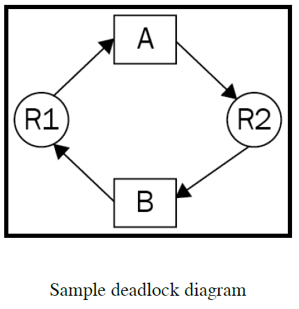

Neither of the resources can be shared across separate processes, and each process needs to access both resources to execute its instructions. Take process A, for example. It is already holding resource R1, but its also needs R2 to proceed with its execution. However, R2 cannot be acquired by process A, as it is being held by process B. So, process A cannot proceed. The same goes for process B, which is holding R2 and needs R1 to proceed. R1 is, in turn, held by process A.

## Python Simulation

In this section, we will implement the preceding situation in an actual Python program. Specifically, we will have two locks (we will call them lock A and lock B), and two separate threads interacting with the locks (thread A and thread B). In our program, we will set up a situation in which thread A has acquired lock A and is waiting to acquire lock B, which has already been acquired by thread B, which is, in turn, waiting for lock A to be released.

```Python
import threading
import time

lock_a = threading.Lock()
lock_b = threading.Lock()


def thread_a():
  print("Thread A is starting...")
  print("Thread A waiting to acquire lock A.")

  lock_a.acquire()

  print("Thread A has acquire lock A, performing some calculation...")
  time.sleep(2)

  print("Thread A waiting to acquire lock B.")
  lock_b.acquire()
  print("Thread A has acquired lock B, performing some calculation...")
  time.sleep(2)

  print("Thread A releasing both locks.")
  lock_a.release()
  lock_b.release()


def thread_b():
  print("Thread B is starting...")
  print("Thread B waiting to acquire lock A.")

  lock_b.acquire()

  print("Thread B has acquire lock B, performing some calculation...")
  time.sleep(2)

  print("Thread B waiting to acquire lock A.")
  lock_a.acquire()
  print("Thread B has acquired lock A, performing some calculation...")
  time.sleep(2)

  print("Thread B releasing both locks.")
  lock_b.release()
  lock_a.release()


thread1 = threading.Thread(target=thread_a)
thread2 = threading.Thread(target=thread_b)

thread1.start()
thread2.start()

thread1.join()
thread2.join()

print('Finished.')
```

In this script, the thread_a() and thread_b() functions specify our thread A and thread B, respectively. In our main program, we also have two threading.Lock objects: lock A and lock B. The general structure of the thread instructions is as follows:

1. Start the thread
2. Try to acquire the lock with the same name as the thread (thread A will try to acquire lock A, and thread B will try to acquire lock B)
3. Perform some calculations
4. Try to acquire the other lock (thread A will try to acquire lock B, and thread B will try to acquire lock A)
5. Perform some other calculations
6. Release both locks
7. End the thread

Note that we are using the time.sleep() function to simulate the action of some calculations being processed.

First of all, we are starting both thread A and thread B almost simultaneously, within the main program. With the structure of the thread instruction set in mind, we can see that at this point, both threads will be initiated; thread A will try to acquire lock A, and will succeed in doing so, since lock A is still available at this point. The same goes for thread B and lock B. The two threads will then go on to perform some calculations on their own.

Let us consider the current state of our program: lock A has been acquired by thread A, and lock B has been acquired by thread B. After their respective calculation processes are complete, thread A will then try to acquire lock B, and thread B will try to acquire lock A. We can easily see that this is the beginning of our deadlock situation: since lock B is already being held by thread B, and cannot be acquired by thread A, thread B, for the same reason, cannot acquire lock A.

Both of the threads will now wait infinitely, in order to acquire their respective second lock. However, the only way a lock can be released is for a thread to continue its execution instructions and release all of the locks it has at the end. Our program will therefore be stuck in its execution at this point, and no further progress will be made.

The following diagram further illustrates the process of how the deadlock unfolds, in sequence:

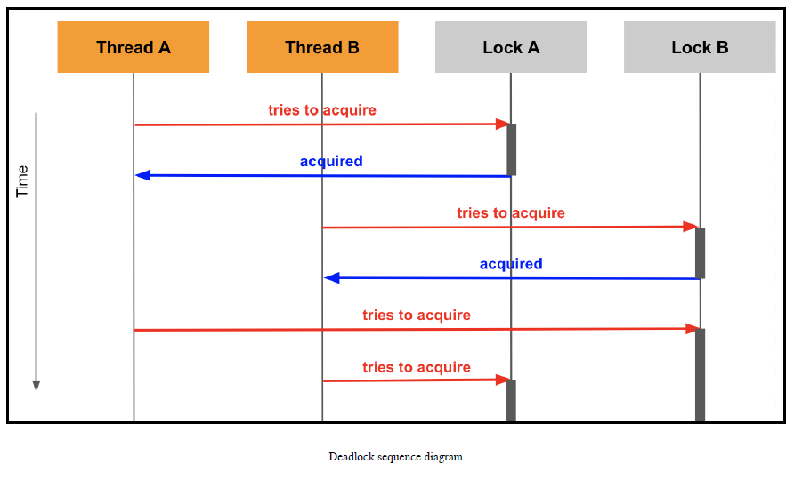

Now, let's see the deadlock that we have created in action. Run the script, and you should obtain the following output:

```bash
Thread A is starting...
Thread A waiting to acquire lock A.
Thread B is starting...
Thread A has acquired lock A, performing some calculation...
Thread B waiting to acquire lock B.
Thread B has acquired lock B, performing some calculation...
Thread A waiting to acquire lock B.
Thread B waiting to acquire lock A.
```

As we discussed, since each thread is trying to acquire a lock that is currently held by the other thread, and the only way for a lock to be released is for a thread to continue its execution. This is a deadlock, and your program will hang infinitely, never reaching the final print statement in the last line of the program.

## Approaches to deadlock situations

As we have seen, deadlock can lead our concurrent programs to an infinite hang, which is undesirable in every way. In this section, we will be discussing potential approaches to prevent deadlocks from occurring. Intuitively, each approach looks to eliminate one of the four Coffman conditions from our program, in order to prevent deadlocks.

## Implementing ranking among resources

From both the Dining Philosophers problem and our Python example, we can see that the last condition of the four Coffman conditions, circular wait, is at the heart of the problem of deadlock. It specifies that the different processes (or threads) in our concurrent program wait for resources held by other processes (or threads) in a circular manner. Giving this a closer look, we can see that the root cause for this condition is the order (or lack thereof) in which the processes (or threads) access the resources.

In the Dining Philosophers problem, each philosopher is instructed to pick up the fork on their left side first, while in our Python example, the threads always try to acquire the locks with the same name before performing any calculations. As you have seen, when the philosophers want to start eating at the same time, they will pick up their respective left forks, and will be stuck in an infinite wait; similarly, when the two threads start their execution at the same time, they will acquire their individual locks, and, again, they will wait for the other locks infinitely.

The conclusion that we can infer from this is that if, instead of accessing the resources arbitrarily, the processes (or threads) were to access them in a predetermined, static order, the circular nature of the way that they acquire and wait for the resources will be eliminated. So, for our two-lock Python example, instead of having thread A try to acquire lock A and thread B try to acquire lock B in their respective execution instructions, we will require that both threads try to acquire the locks in the same order. For example, both threads will now try to acquire lock A first, perform some calculations, try to acquire lock B, perform further calculations, and finally, release both threads.

```Python
import threading
import time

lock_a = threading.Lock()
lock_b = threading.Lock()


def thread_a():
  print("Thread A is starting...")
  print("Thread A waiting to acquire lock A.")
  lock_a.acquire()
  print("Thread A has acquired lock A, performing some calculation...")
  time.sleep(2)

  print('Thread A waiting to acquire lock B.')
  lock_b.acquire()
  print('Thread A has acquired lock B, performing some calculation...')
  time.sleep(2)

  print("Thread A releasing both locks.")
  lock_a.release()
  lock_b.release()


def thread_b():
  print("Thread B is starting...")
  print("Thread B waiting to acquire lock A.")
  lock_a.acquire()
  print("Thread B has acquired lock A, performing some calculation...")
  time.sleep(5)

  print('Thread B waiting to acquire lock B.')
  lock_b.acquire()
  print('Thread B has acquired lock B, performing some calculation...')
  time.sleep(5)

  print("Thread B releasing both locks.")
  lock_a.release()
  lock_b.release()


thread1 = threading.Thread(target=thread_a)
thread2 = threading.Thread(target=thread_b)

thread1.start()
thread2.start()

thread1.join()
thread2.join()

print('Finished.')
```

This version of the script is now able to finish its execution, and should produce the following output:

```bash
Thread A is starting...
Thread A waiting to acquire lock A.
Thread A has acquired lock A, performing some calculation...
Thread B is starting...
Thread B waiting to acquire lock A.
Thread A waiting to acquire lock B.
Thread A has acquired lock B, performing some calculation...
Thread A releasing both locks.
Thread B has acquired lock A, performing some calculation...
Thread B waiting to acquire lock B.
Thread B has acquired lock B, performing some calculation...
Thread B releasing both locks.
Finished.
```

This approach efficiently eliminates the problem of deadlock in our two-lock example, but how well does it hold up for the Dining Philosophers problem? To answer this question, let's try to simulate the problem and the solution in Python by ourselves.

```Python
import threading


def philosopher(left, right):
  while True:
    with left:
      with right:
        print(f'Philosopher at {threading.current_thread()} is eating.')


N_FORKS = 5
forks = [threading.Lock() for _ in range(N_FORKS)]

phils = [threading.Thread(
  target=philosopher,
  args=(forks[n], forks[(n + 1) % N_FORKS])) for n in range(N_FORKS)]

for p in phils:
  p.start()
```

Here, we have the philospher() function as the underlying logic for our separate threads. It takes in two Threading.Lock objects and simulates the previously discussed eating procedure, with two context managers. In our main program, we create a list of five lock objects, named forks, and a list of five threads, named phils, with the specification that the first thread will take in the first and second locks, the second thread will take in the second and third locks, and so on; and the fifth thread will take in the fifth and first locks (in order). Finally, we start all five threads simultaneously.

Run the script, and it can easily be observed that deadlock occurs almost immediately. The following is my output, up until the program hangs infinitely:

```bash
Philosopher at <Thread(Thread-1, started 123145445048320)> is eating.
Philosopher at <Thread(Thread-1, started 123145445048320)> is eating.
Philosopher at <Thread(Thread-1, started 123145445048320)> is eating.
Philosopher at <Thread(Thread-1, started 123145445048320)> is eating.
Philosopher at <Thread(Thread-1, started 123145445048320)> is eating.
Philosopher at <Thread(Thread-1, started 123145445048320)> is eating.
Philosopher at <Thread(Thread-3, started 123145455558656)> is eating.
Philosopher at <Thread(Thread-1, started 123145445048320)> is eating.
Philosopher at <Thread(Thread-3, started 123145455558656)> is eating.
Philosopher at <Thread(Thread-3, started 123145455558656)> is eating.
Philosopher at <Thread(Thread-3, started 123145455558656)> is eating.
Philosopher at <Thread(Thread-3, started 123145455558656)> is eating.
Philosopher at <Thread(Thread-5, started 123145466068992)> is eating.
Philosopher at <Thread(Thread-3, started 123145455558656)> is eating.
Philosopher at <Thread(Thread-3, started 123145455558656)> is eating.
```

## Ignoring locks and sharing resources

Locks are undoubtedly an important tool in synchronization tasks, and in concurrent programming in general. However, if the use of locks leads to an undesirable situation, such as a deadlock, then it is quite natural for us to explore the option of simply not using locks in our concurrent programs. By ignoring locks, our program's resources effectively become shareable among different processes/threads in a concurrent program, thus eliminating the first of the four Coffman conditions: mutual exclusion.

This approach to the problem of deadlock can be straightforward to implement; let us try with the two preceding examples. In the two-lock example, we simply remove the code specifying any interaction with the lock objects both inside the thread functions and in the main program. In other words, we are not utilizing a locking mechanism anymore:

```Python
import threading
import time
from timeit import default_timer as timer


def thread_a():
  print("Thread A is starting...")
  print("Thread A is performing some calculation...")
  time.sleep(2)
  print("Thread A is performing some calculation...")
  time.sleep(2)


def thread_b():
  print("Thread B is starting...")
  print("Thread B is performing some calculation...")
  time.sleep(5)
  print("Thread B is performing some calculation...")
  time.sleep(5)


thread1 = threading.Thread(target=thread_a)
thread2 = threading.Thread(target=thread_b)

start = timer()

thread1.start()
thread2.start()

thread1.join()
thread2.join()

print("Took {:.2f} seconds".format(timer() - start))
print("Finshed.")
```

Run the script, and your output should look similar to the following:

```bash
Thread A is starting...
Thread A is performing some calculation...
Thread B is starting...
Thread B is performing some calculation...
Thread A is performing some calculation...
Thread B is performing some calculation...
Took 10.00 seconds.
Finished.
```

It is clear that since we are not using locks to restrict access to any calculation processes, the executions of the two threads have now become entirely independent of one another, and the threads were therefore run completely in parallel. For this reason, we also obtained a better speed: since the threads ran in parallel, the total time that the whole program took was the same as the time that the longer task of the two threads took (in other words, thread B, with 10 seconds).

What about the Dining Philosophers problem? It seems that we can also conclude that without locks (the forks), the problem can be solved easily. Since the resources (food) are unique to each philosopher (in other words, no philosopher should eat another philosopher's food), it should be the case that each philosopher can proceed with their execution without worrying about the others. By ignoring the locks, each can be executed in parallel, similar to what we saw in our two-lock example.

Doing this, however, means that we are completely misunderstanding the problem. We know that locks are utilized so that processes and threads can access the shared resources in a program in a systematic, coordinated way, to avoid mishandling the data. Therefore, removing any locking mechanisms in a concurrent program means that the likelihood of the shared resources, which are now free from access limitations, being manipulated in an uncoordinated way (and therefore, becoming corrupted) increases significantly.

So, by ignoring locks, it is relatively likely that we will need to completely redesign and restructure our concurrent program. If the shared resources still need to be accessed and manipulated in an organized way, other synchronization methods will need to be implemented. The logic of our processes and threads might need to be altered to appropriately interact with this new synchronization method, the execution time might be negatively affected by this change in the structure of the program, and other potential synchronization problems might also arise.

## An additional note about locks

While the approach of dismissing locking mechanisms in our program to eliminate deadlocks might raise some questions and concerns, it does effectively reveal a new point for us about lock objects in Python: it is possible for an element of a concurrent program to completely bypass the locks when accessing a given resource. In other words, lock objects only prevent different processes/threads from accessing and manipulating a shared resource if those processes or threads actually acquire the lock objects.

Locks, then, do not actually lock anything. They are simply flags that help to indicate whether a resource should be accessed at a given time; if a poorly instructed, or even malicious, process/thread attempts to access that resource without checking the lock object exists, it will most likely be able to do that without difficulty. In other words, locks are not at all connected to the resources that they are supposed to lock, and they most certainly do not block processes/threads from accessing those resources.

The simple use of locks is therefore inefficient to design and implement a secure, dynamic, concurrent data structure. To achieve that, we would need to either add more concrete links between the locks and their corresponding resources, or utilize a different synchronization tool altogether (for example, atomic message queues).

## Concluding note on deadlock solutions

You have seen two of the most common approaches to the problem of deadlock. Each addresses one of the four Coffman conditions, and, while both (somewhat) successfully prevent deadlocks from occurring in our examples, each raises different, additional problems and concerns. It is therefore important to truly understand the nature of your concurrent programs, in order to know which of the two is applicable, if either of them are.

It is also possible that some programs, through deadlock, are revealed to us as unsuitable to be made concurrent; some programs are better left sequential, and will be made worse with forced concurrency. As we have discussed, while concurrency provides significant improvements in many areas of our applications, some are inherently inappropriate for the application of concurrent programming. In situations of deadlock, developers should be ready to consider different approaches to designing a concurrent program, and should not be reluctant to implement another method when one concurrent approach does not work.

## The concept of livelock

The concept of livelock is connected to deadlock; some even consider it an alternate version of deadlock. In a livelock situation, the processes (or threads) in the concurrent program are able to switch their states; in fact, they switch states constantly. Yet, they simply switch back and forth infinitely, and no progress is made. We will now consider an actual scenario of livelock.

Suppose that a pair of spouses are eating dinner together at a table. They only have one fork to share with each other, so only one of them can eat at any given point. Additionally, the spouses are really polite to each other, so even if one spouse is hungry and wants to eat their food, they will leave the fork on the table if their partner is also hungry. This specification is at the heart of creating a livelock for this problem: when both spouses are hungry, each will wait for the other to eat first, creating a infinite loop in which each spouse switches between wanting to eat and waiting for the other spouse to eat.

```Python
import threading
import time
from typing import Type


class Spouse(threading.Thread):
  def __init__(self, name, partner):
    threading.Thread.__init__(self)
    self.name = name
    self.partner: 'Spouse' = partner
    self.hungry = True

  def run(self):
    while self.hungry:
      print("{0} is hungry and wants to eat".format(self.name))

      if self.partner.hungry:
        print("{0} is waiting for their partner to eat first...".format(self.name))
      else:
        with fork:
          print("{0} has started eating.".format(self.name))
          time.sleep(5)

          print("{0} is now full".format(self.name))
          self.hungry = False
```

This class inherits from the threading.Thread class and implements the logic that we discussed previously. It takes in a name for the Spouse instance and another Spouse object as its partner; when initialized, a Spouse object is also always hungry (the hungry attribute is always set to True). The run() function in the class specifies the logic when the thread is started: as long as the Spouse object's hungry attribute is set to True, the object will attempt to use the fork, which is a lock object, to eat. However, it always checks to see whether its partner also has its hungry attribute set to True, in which case, it will not proceed to acquire the lock, and will instead wait for its partner to do it.

In our main program, we create the fork as a lock object first; then, we create two Spouse thread objects, which are each other's partner attributes. Finally, we start both threads, and run the program until both threads finish executing:

```Python
fork = threading.Lock()

partner1 = Spouse('Wife', None)
partner2 = Spouse('Husband', partner1)
partner1.partner = partner2

partner1.start()
partner2.start()

partner1.join()
partner2.join()

print("Finished.")
```

Run the script, and you will see that, as we discussed, each thread will go into an infinite loop, switching between wanting to eat and waiting for its partner to eat; the program will run forever, until Python is interrupted. The following code shows the first few lines of the output that I obtained:

```bash
Wife is hungry and wants to eat.
Wife is waiting for their partner to eat first...
Husband is hungry and wants to eat.
Wife is hungry and wants to eat.
Husband is waiting for their partner to eat first...
Wife is waiting for their partner to eat first...
Husband is hungry and wants to eat.
Wife is hungry and wants to eat.
Husband is waiting for their partner to eat first...
Wife is waiting for their partner to eat first...
Husband is hungry and wants to eat.
Wife is hungry and wants to eat.
Husband is waiting for their partner to eat first...
...
```

# 13. Starvation

## The concept of starvation

Starvation is a problem in concurrent systems, in which a process (or a thread) cannot gain access to the necessary resources in order to proceed with its execution and, therefore, cannot make any progress.

## What is starvation ?

It is quite common for a concurrent program to implement some sort of ordering between the different processes in its execution. For example, consider a program that has three separate processes, as follows:

* One is responsible for handling extremely pressing instructions that need to be run as soon as the necessary resources become available

* Another process is responsible for other important executions, which are not as essential as the tasks in the first process

* The last one handles miscellaneous, very infrequent tasks

Furthermore, these three process need to utilize the same resources in order to execute their respective instructions.

Intuitively, we have every reason to implement a specification that allows the first process to have the highest priority of execution and access to resources, then the second process, and then the last process, with the lowest priority. However, imagine situations in which the first two processes (with higher priorities) run so often that the third process cannot execute its instructions; anytime the third process needs to run, it checks to see whether the resources are available to be used and finds out that one of the other, higher-priority processes is using them.

This is a situation of starvation: the third process is given no opportunity to execute and, therefore, no progress can be made with that process. In a typical concurrent program, it is quite common to have more than three processes at different priority levels, yet the situation is fundamentally similar: some processes are given more opportunities to run and, therefore, they are constantly executing. Others have lower priorities and cannot access the necessary resources to execute.

## Scheduling

In the next few subsections, we will be discussing the potential candidates that cause starvation situations. Most of the time, a poorly coordinated set of scheduling instructions is the main cause of starvation. For example, a considerably naive algorithm that deals with three separate tasks might implement constant communication and interaction between the first two tasks.

This setup leads to the fact that the execution flow of the algorithm switches solely between the first and second tasks, while the third finds itself idle and unable to make any progress with its execution; in this case, because it is starved of CPU execution flow. Intuitively, we can identify the root of the problem as the fact that the algorithm allows the first two tasks to always dominate the CPU, and hence, effectively prevents any other task to also utilize the CPU. A characteristic of a good scheduling algorithm is the ability to distribute the execution flow and allocate the resources equally and appropriately.

As mentioned previously, many concurrent systems and programs implement a specific order of priority, in terms of process and thread execution. This implementation of ordered scheduling may very likely lead to the starvation of processes and threads of lower priorities and can result in a condition called priority inversion.

Suppose that, in your concurrent program, you have process A of the highest priority, process B of a medium priority, and finally, process C of the lowest priority; process C would most likely be put in the situation of starvation. Additionally, if the execution of process A, the prioritized process, is dependent on the completion of process C, which is already in starvation, then process A might never be able to complete its execution, either, even though it is given the highest priority in the concurrent program.

The following diagram further illustrates the concept of priority inversion: a high-priority task running from the time t2 to t3 needs to access some resources, which are being utilized by a low-priority task:

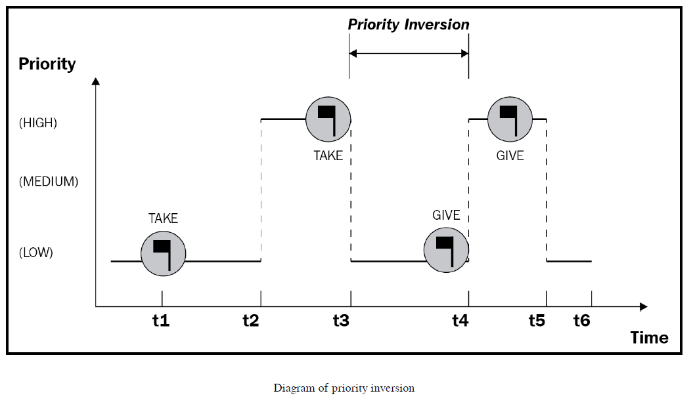

To reiterate, combining starvation and priority inversion can lead to a situation where even the high-priority tasks are unable to execute their instructions.

## Causes of starvation

With the complexity of designing a scheduling algorithm in mind, let us discuss the specific causes of starvation. The situations that we described in the preceding section indicate some potential causes of the situation of starvation. However, starvation can arise from a number of sources, as follows:

* Processes (or threads) with high priorities dominate the execution flow in the CPU, and hence, low-priority processes (or threads) are not given the opportunity to execute their own instructions.

* Processes (or threads) with high priorities dominate the usage of non-shareable resources, and hence, low-priority processes (or threads) are not given the opportunity to execute their own instructions. This situation is similar to the first one, but addresses the priority of accessing resources, instead of the priority of the execution itself.

* Processes (or threads) with low priorities are waiting for resources to execute their instructions, but, as soon as the resources become available, other processes (or threads) with higher priorities are immediately given access to them, so the low-priority processes (or threads) wait infinitely.

There are other causes of starvation, as well, but the preceding are the most common root causes.

## Starvation's relationship to deadlock

Interestingly, deadlock situations can also lead to starvation, as the definition of starvation states that if there is a process (or a thread) that is unable to make any progress because it cannot gain access to the necessary process, the process (or thread) is experiencing starvation.

Recall our example of deadlock, the Dining Philosophers problem, illustrated as follows:


When deadlock occurs for this situation, no philosopher can obtain the necessary resources to execute their instructions (each philosopher is required to have two forks to start eating). Each philosopher that is in a deadlock is therefore also in a state of starvation.

## The readers-writers problem

The readers-writers problem is one of the classic and most complex examples in the field of computer science, illustrating problems that might occur in a concurrent program. Throughout the analysis of the different variations of the readers-writers problem, we will reveal more about starvation, as well as its common causes. We will also simulate the problem in Python, so that a deeper understanding of the problem can be gained.

### statement

In a readers-writers problem, first and foremost, we have a shared resource, which, in most cases, is a text file. Different threads interact with that text file; each is either a reader or a writer. A reader is a thread that simply accesses the shared resource (the text file) and reads in the data included in that file, while a writer is a thread that accesses, and possibly mutates, the contents of the text file.

We know that writers and readers cannot access the shared resources simultaneously since if a thread is writing data to the file, no other thread should be accessing the file to read any data from it. The goal of the readers-writers problem is therefore to find a correct and efficient way to design and coordinate the scheduling of these reader and writer thread. A successful implementation of that goal is not only that the program as a whole executes in the most optimized way, but also that all threads are given sufficient opportunity to execute their instructions and no starvation can occur. Additionally, the shared resource (the text file) needs to be handled appropriately, so that no data will be corrupted.

The following diagram further illustrates the setup of the readers-writers problem:

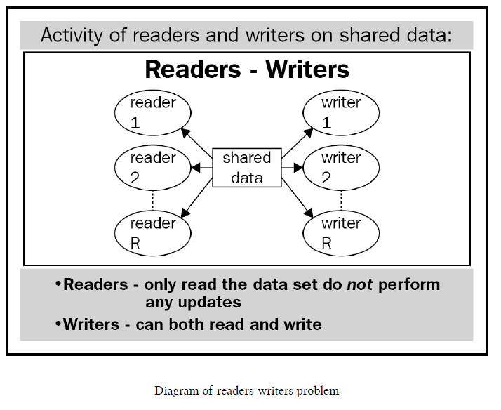

## The first readers-writers problem

As we mentioned, the problem asks us to come up with a scheduling algorithm, so that readers and writers can access the text file appropriately and efficiently, without mishandling/corrupting the data that is included. A naive solution to this problem is to impose a lock on the text file, so that it becomes a non-shareable resource; this means that only one thread (either a reader or a writer) can access (and potentially manipulate) the text file at any given time.

Yet, this approach simply equates to a sequential program: if the shared resource can be utilized by only one thread at a given time, none of the processing time between different threads can be overlapped, and effectively, the execution becomes sequential. Therefore, this is not an optimal solution, as it is taking advantage of concurrent programming.

One insight regarding the reader threads can lead to a more optimal solution to this problem: since readers simply read in the text file and do not alter the data in it, multiple readers can be allowed to access the text file simultaneously. Indeed, even if more than one reader is fetching data from the text file at the same time, the data is not being changed in any way, and the consistency and accuracy of the data is therefore maintained.

Following this approach, we will implement a specification in which no reader will be kept waiting if the shared resource is being opened for reading by another reader. Specifically, in addition to a lock on the shared resource, we will also have a counter for the number of readers currently accessing the resource. If, at any point in the program, that counter goes from zero to one (in other words, at least one reader is starting to access the resource), we will lock the resource from the writers; similarly, whenever the counter decreases to zero (in other words, no reader is asking for access to the resource), we will release the lock on the resource, so that writers can access it.

This specification is efficient for the readers, in the sense that, once the first reader has accessed the resource and placed a lock on it, no writers can access it, and the subsequent readers will not have to re-lock it until the last reader finishes reading the resource.

```Python
import threading


def writer():
  global text

  while True:
    with resource:
      print("Writing being done by {0}".format(threading.current_thread().name))
      text += "Writing was done by {0}".format(threading.current_thread().name)


def reader():
  global rcount

  while True:
    with rcounter:
      rcount += 1
      if rcount == 1:
        resource.acquire()
        print("Reading being done by {0}".format(threading.current_thread().name))
        print(text)

      with rcounter:
        rcount -= 1
        if rcount == 0:
          resource.release()
```

In the preceding script, the writer() function, which is to be called by a threading.Thread instance (in other words, a separate thread), specifies the logic of the writer threads that we discussed previously: accessing the shared resource (in this case, the global variable, text, which is simply a Python string) and writing some data to the resource. Note that we are putting all of its instructions inside a while loop, to simulate the constant nature of the application (writers and readers constantly try to access the shared resource).

We can also see the reader logic in the reader() function. Before asking for access to the shared resource, each reader will increment a counter for the number of readers that are currently active and trying to access the resource. Similarly, after reading data off the file, each reader needs to decrement the number of readers. During this process, if a reader is the first reader to access the file (in other words, when the counter is one), it will put a lock on the file, so that no writers can access it; conversely, when a reader is the last reader to read the file, it has to release that lock.

One note about the handling of that counter of readers: you might have noticed that we are using a lock object named rcounter when incrementing/decrementing the counter variable (rcount). This is a method that is used to avoid a race condition, which is another common concurrency-related problem, for the counter variable; specifically, without the lock, multiple threads can be accessing and altering the counter variable at the same time, but the only way to ensure the integrity of the data is for this counter variable to be handled sequentially. We will discuss race conditions (and the practice that is used to avoid them) in more detail in the next chapter.

Going back to our current script, in the main program, we will set up the text variable, the counter for readers, and two lock objects (for the reader counter and the shared resource, respectively). We are also initializing and starting three reader threads and two writer threads, as follows:

```Python
text = 'This is some text.'
rcount = 0
rcounter = threading.Lock()
resource = threading.Lock()

threads = [threading.Thread(target=reader) for _ in range(3)] + [threading.Thread(target=writer) for _ in range(2)]

for thread in threads:
  thread.start()
```

It is important to note that, since the instructions of the reader and writer threads are both wrapped in while loops, the script, when started, will run infinitely. You should cancel the Python execution after around 3-4 seconds, when enough output has been produced so that the general behavior of the program can be observed.

The following code shows the first few lines of output that I obtained after running the script:

```bash
Reading being done by Thread-1:
This is some text.
Reading being done by Thread-2:
Reading being done by Thread-1:
This is some text.
This is some text.
Reading being done by Thread-2:
Reading being done by Thread-1:
This is some text.
This is some text.
Reading being done by Thread-3:
Reading being done by Thread-1:
This is some text.
This is some text.
...
```

As you can see, there is a specific pattern in the preceding output: all of the threads that were accessing the shared resource were readers. In fact, throughout my entire output, no writer was able to access the file, and therefore, the text variable only contains the initial string, This is some text., and was not altered in any way. The output that you obtain should also have the same pattern (the shared resource not being altered).

In this case, the writers are experiencing starvation, as none of them are able to access and use the resource. This is a direct result of our scheduling algorithm; since multiple readers are allowed to access the text file simultaneously, if there are multiple readers accessing the text file frequently enough, it will create a continuous stream of readers going through the text file, giving no room for a writer to attempt to access the file.

This scheduling algorithm inadvertently gives priority to the readers over the writers, and is therefore called readers-preference. So, this design is undesirable.

## The second readers-writers problem

The problem with the first approach is that, when a reader is accessing the text file and a writer is waiting for the file to be unlocked, if another reader starts its execution and wants to access the file, it will be given priority over the writer that has already been waiting. Additionally, if more and more readers keep requesting access to the file, the writer will be waiting infinitely, and that was what we observed in our first code example.

To address this problem, we will implement the specification that, once a writer makes a request to access the file, no reader should be able to jump in line and access the file before that writer. To do this, we will have an additional lock object in our program, to specify whether a writer is waiting for the file, and consequently, whether a reader thread can attempt to read the file; we will call this lock read_try.

Similar to how the first of the readers accessing the text file always locks it from the writers, we will now have the first writer of the multiple that are waiting to access the file lock read_try, so that no reader can, again, jump in line before those writers that requested access before it. As we discussed in reference to the readers, since we are keeping track of the number of writers waiting for the text file, we will need to implement a counter for the number of writers, and its corresponding lock, in our program.

```Python
import threading


def writer():
  global text
  global wcount

  while True:
    with wcounter:
      wcount += 1
      if wcount == 1:
        read_try.acquire()

    with resource:
      print("Writing being done by {0}".format(threading.current_thread().name))
      text += "Writing was done by {0}".format(threading.current_thread().name)

    with wcounter:
      wcount -= 1
      if wcount == 0:
        read_try.release()


def reader():
  global rcount

  while True:
    with read_try:
      with rcounter:
        rcount += 1
        if rcount == 1:
          resource.acquire()

      print("Reading being done by {0}".format(threading.current_thread().name))
      print(text)

      with rcounter:
        rcount -= 1
        if rcount == 0:
          resource.release()


text = "This is some text."
wcount = 0
rcount = 0

wcount = threading.Lock()
rcounter = threading.Lock()
resource = threading.Lock()
read_try = threading.Lock()

threads = [threading.Thread(target=reader) for _ in range(3)] + [threading.Thread(target=writer) for _ in range(2)]

for thread in threads:
  thread.start()
```

Compared to our first solution to the problem, the main program remains relatively the same (except for the initialization of the read_try lock, the wcount counter, and its lock, wcounter), but in our writer() function, we are locking read_try as soon as there is at least one writer waiting to access the file; when the last writer finishes its execution, it will release the lock, so that any reader waiting for the file can now access it.

Again, to see the output produced by the program, we will have it run for 3-4 seconds, and then cancel the execution, as the program would otherwise run forever. The following is the output that I obtained via this script:

```bash
Reading being done by Thread-1:
This is some text.
Reading being done by Thread-1:
This is some text.
Writing being done by Thread-4.
Writing being done by Thread-5.
Writing being done by Thread-4.
Writing being done by Thread-4.
Writing being done by Thread-4.
Writing being done by Thread-5.
Writing being done by Thread-4.
...
```

It can be observed that, while some readers were able to access the text file (indicated by the first four lines of my output), once a writer gained access to the shared resource, no reader was able to access it anymore. The rest of my output included messages about writing instructions: Writing being done by, and so on. As opposed to what we saw in the first solution of the readers-writers problem, this solution is giving priority to writers, and, as a consequence, the readers are starved. This is therefore called writers-preference.

The priority that writers were given over readers resulted from the fact that, while only the first and the last writers have to acquire and release the read_try lock, respectively, each and every reader wanting to access the text file have to interact with that lock object individually. Once read_try is locked by a writer, no reader can even attempt to execute its instructions, let alone try to access the text file.

There are cases in which some readers are able to gain access to the text file, if the readers are initialized and executed before the writers (for example, in our program, the readers were the first three elements, and the writers were the last two, in our list of threads). However, once a writer is able to access the file and acquire the read_try lock during its execution, starvation will most likely occur for the readers.

This solution is also not desirable, as it gives higher priority to the writer threads in our program.

## The third readers-writers problem

You have seen that both of the solutions that we tried to implement can result in starvation, by not giving equal priorities to the separate threads; one can starve the writers, and the other can starve the readers. A balance between these two approaches might give us an implementation with equal priorities among the readers and writers, and hence, solve the problem of starvation.

Recall this: in our second approach, we are placing a lock on a reader's attempt to access the text file, requiring that no writer will be starved once it starts waiting for the file. In this solution, we will implement a lock that also utilizes this logic, but is then applied to both readers and writers. All of the threads will then be subjected to the constraints of the lock, and equal priority will hence be achieved among the separate threads.

Specifically, this is a lock that specifies whether a thread will be given access to the text file at a given moment; we will call this the service lock. Each writer or reader has to try to acquire this service lock before executing any of its instructions. A writer, having obtained this service lock, will also attempt to obtain the resource lock and release the service lock immediately thereafter. The writer will then execute its writing logic and finally release the resource lock at the end of its execution.

```Python
def writer():
  global text

  while True:
    with service:
      resource.require()

    print("Writing being done by {0}".format(threading.current_thread().name))
    text += "Writing being done by {0}".format(threading.current_thread().name)

    resource.release()
```

A reader, on the other hand, will also need to acquire the service lock first. Since we are still allowing multiple readers to access the resource at the same time, we are implementing the reader counter and its corresponding lock.

The reader will acquire the service lock and the counter lock, increment the reader counter (and potentially, lock the resource), and then release the service lock and counter lock, sequentially. Now, it will actually read data off the text file, and finally, it will decrement the reader counter, and will potentially release the resource lock, if it is the last reader to access the file at that time.

The reader() function contains this specification, as follows:

```Python
def reader():
  global rcount

  while True:
    with service:
      rcounter.acquire()
      rcount += 1

      if rcount == 1:
        resource.acquire()

    rcounter.release()

    print("Reading being done by {0}".format(threading.current_thread().name))
    print(text)

    with rcounter:
      rcount -= 1
      if rcount == 0:
        resource.release()
```

Finally, in our main program, we initialize the text string, the reader counter, all of the necessary locks, and the reader and writer threads, as follows:

```Python 
text = "This is some text."
rcount = 0

rcounter = threading.Lock()
resource = threading.Lock()
service = threading.Lock()

threads = [threading.Thread(target=reader) for _ in range(3)] + [threading.Thread(target=writer) for _ in range(2)]

for thread in threads:
    thread.start()
```

Note that, we are commenting the code that prints out the current content of the text file in the reader() function for readability for our output later on. Run the program for 3-4 seconds, and then cancel it. The following output is what I obtained on my personal computer:

```bash
Reading being done by Thread-3:
Writing being done by Thread-4.
Reading being done by Thread-1:
Writing being done by Thread-5.
Reading being done by Thread-2:
Reading being done by Thread-3:
Writing being done by Thread-4.
...
``` 

The pattern that we have with this current output is that the readers and writers are able to access the shared resource cooperatively and efficiently; all of the readers and writers are executing their instructions, and no thread is being starved by this scheduling algorithm.

Note that as you work with a reader-writer problem in your concurrent program, you do not have to reinvent the wheel regarding the approaches that we just discussed. PyPI actually has an external library called readerwriterlock that contains the implementation of the three approaches in Python, as well as supports for timeouts.

## Solutions to starvation

Through an analysis of different approaches to the readers-writers problem, you have seen the key to solving starvation: since some threads will be starved if they are not given a high priority in accessing the shared resources, implementing fairness in the execution of all of the threads will prevent starvation from occurring. Fairness, in this case, does not require a program to forgo any order or priority that it has imposed on the different threads; but to implement fairness, a program needs to ensure that all threads are given sufficient opportunities to execute their instructions.

Keeping this idea in mind, we can potentially address the problem of starvation by implementing one (or a combination) of the following approaches:

* Increasing the priority of low-priority threads: As we did with the writer threads in the second approach and the reader threads in the third approach to the readers-writers problem, prioritizing the threads that would otherwise not have any opportunity to access the shared resource can successfully eliminate starvation.

* First-in-first-out thread queue: To ensure that a thread that started waiting for the shared resource before another thread will be able to acquire the resource before the other thread, we can keep track of the threads requesting access in a first-in-first-out queue.

* Other methods: Several methods can also be implemented to balance the selection frequency of different threads. For example, a priority queue that also gives gradually increasing priority to threads that have been waiting in the queue for a long time, or if a thread has been able to access the shared resource for many times, it will be given less priority, and so on.

Solving starvation in your concurrent program can be a rather complex and involved process, and a deep understanding of its scheduling algorithm, combined with an understanding of how processes and threads interact with the shared resources, is necessary during the process. As you saw in the example of the readers-writers problem, it can also take several implementations and revisions of different approaches to arrive at a good solution to starvation

# 14. Race Conditions

## The concept of race conditions

A race condition is typically defined as a phenomenon during which the output of a system is indeterminate and dependent on the scheduling algorithm and the order in which tasks are scheduled and executed. When the data becomes mishandled and corrupted during this process, a race condition becomes a bug in the system. Given the nature of this problem, it is quite common for a race condition to occur in concurrent systems, which emphasize scheduling and coordinating independent tasks.

A race condition can occur in both an electronic hardware system and a software application; in this chapter, we will only be discussing race conditions in the context of software development—specifically, concurrent software applications. This section will cover the theoretical foundations of race conditions and their root causes and the concept of critical sections.

## Critical sections

Critical sections indicate shared resources that are accessed by multiple processes or threads in a concurrent application, which can lead to unexpected, and even erroneous, behavior. We have seen that there are multiple methods to protect the integrity of the data contained in these resources, and we call these protected sections critical sections.

As you can imagine, the data in these critical sections, when interacted with and altered concurrently or in parallel, can become mishandled or corrupted. This is especially true when the threads and processes interacting with it are poorly coordinated and scheduled. The logical conclusion, therefore, is to not allow multiple agents to go into a critical section at the same time. We call this concept mutual exclusion.

## How race conditions occur

Let's consider a simple concurrent program, in order to understand what can give rise to a race condition. Suppose that the program has a shared resource and two separate threads (thread 1 and thread 2) that will access and interact with that resource. Specifically, the shared resource is a number and, as per their respective execution instructions, each thread is to read in that number, increment it by 1, and finally, update the value of the shared resource with the incremented number.

Suppose that the shared number is originally 2, and then, thread 1 accesses and interacts with the number; the shared resource then becomes 3. After thread 1 successfully alters and exits the resource, thread 2 begins to execute its instructions, and the shared resource that is a number is updated to 4. Throughout this process, the number was originally 2, was incremented twice (each time by a separate thread), and held a value of 4 at the end. The shared number was not mishandled and corrupted in this case.

Imagine, then, a scenario in which the shared number is still 2 at the beginning, yet both of the threads access the number at the same time. Now, each of the threads reads in the number 2 from the shared resource, each increments the number 2 to 3 individually, and then, each writes the number 3 back to the shared resource. Even though the shared resource was accessed and interacted with by a thread twice, it only held a value of 3 at the end of the process.

This is an example of a race condition occurring in a concurrent program: since the second thread to access a shared resource does it before the first thread finishes its execution (in other words, writing the new value to the shared resource), the second thread fails to take in the updated resource value. This leads to the fact that, when the second thread writes to the resource, the value that is processed and updated by the first thread is overwritten. At the end of the execution of the two threads, the shared resource has technically only been updated by the second thread.

The following diagram further illustrates the contrast between a correct data handling process and a situation with a race condition:

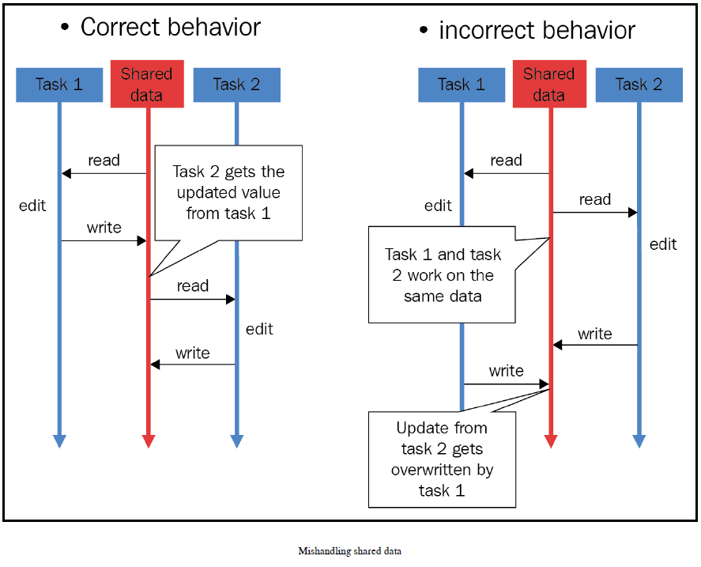

Intuitively, we can see that a race condition can result in the mishandling and corruption of data. In the preceding example, we can see that a race condition can occur with only two separate threads accessing a common resource, causing the shared resource to be updated incorrectly and hold an incorrect value at the end of the program. We know that most reallife concurrent applications contain significantly more threads and processes and more shared resources, and the more threads/processes that interact with the shared resource, the more likely it is that a race condition will occur.

## Simulating race conditions in Python

Before we discuss a solution that we can implement to solve the problem of race conditions, let's try to simulate the problem in Python.

```Python
import random
import time
import threading


def update():
    global counter

    current_counter = counter
    time.sleep(random.randint(0, 1))
    counter = current_counter + 1
```

The goal of the preceding update() function is to increment a global variable called counter, and it is to be called by a separate thread in our script. Inside the function, we are interacting with a shared resource—in this case, counter. We then assign the value of counter to another local variable, called current_counter (this is to simulate the process of reading data from more complex data structures for the shared resources).

Next, we will pause the execution of the function by using the time.sleep() method. The length of the period during which the program will pause is pseudo-randomly chosen between 0 and 1, generated by the function call, random.randint(0, 1), so the program will either pause for one second or not at all. Finally, we assign the newly computed value of current_counter (which is its one-increment) to the original shared resource (the counter variable).

Now, we can move on to our main program:

```Python
counter = 0
threads = [threading.Thread(target=update) for _ in range(20)]

for thread in threads:
  thread.start()

for thread in threads:
  thread.join()

print("Final counter: {0}".format(counter))
print("Finished.")
```

Here, we are initializing the counter global variable with a set of threading.Thread objects, in order to execute the update() function concurrently; we are initializing twenty thread objects, to increment our shared counter twenty times. After starting and joining all of the threads that we have, we can finally print out the end value of our shared counter variable.

Theoretically, a well-designed concurrent program will successfully increment the share counter twenty times in total, and, since its original value is 0, the end value of the counter should be 20 at the end of the program. However, as you run this script, the counter variable that you obtain will most likely not hold an end value of 20. The following is my own output, obtained from running the script:

```bash
Final counter: 9.
Finished.
```

This output indicates that the counter was only successfully incremented nine times. This is a direct result of a race condition that our concurrent program has. This race condition occurs when a specific thread spends time reading in and processing the data from the shared resource (specifically, for one second, using the time.sleep() method), and another thread reads in the current value of the counter variable, which, at this point, has not been updated by the first thread, since it has not completed its execution.

Interestingly, if a thread does not spend anytime processing the data (in other words, when 0 is chosen by the pseudo-random random.randint() method), the value of the shared resource can potentially be updated just in time for the next thread to read and process it. This phenomenon is illustrated by the fact that the end value of the counter varies within different runs of the program. For example, the following is the output that I obtained after running the script three times. The output from the first run is as follows:

```bash
Final counter: 9.
Finished.
```

The output from the second run is as follows:

```bash
Final counter: 12.
Finished.
```

The output from the third run is as follows:

```bash
Final counter: 5.
Finished.
```

Again, the final value of the counter is dependent on the number of threads that spend one second pausing and the number of threads not pausing at all. Since these two numbers are, in turn, dependent on the random.randint() method, the final value of the counter changes between different runs of the program. We will still have a race condition in our program, except for when we can ensure that the final value of the counter is always 20 (the counter being successfully incremented twenty times, in total).

## Locks as a solution to race conditions

In this section, we will discuss the most common solution to race conditions: locks. Intuitively, since the race conditions that we observed arose when multiple threads or processes accessed and wrote to a shared resource simultaneously, the key idea to solving race conditions is to isolate the executions of different threads/processes, especially when interacting with a shared resource. Specifically, we need to make sure that a thread/process can only access the shared resource after any other threads/processes interacting with the resource have finished their interactions with that resource.

## The effectiveness of locks

With locks, we can turn a shared resource in a concurrent program into a critical section, whose integrity of data is guaranteed to be protected. A critical section guarantees the mutual exclusion of a shared resource, and cannot be accessed concurrently by multiple processes or threads; this will prevent any protected data from being updated or altered with conflicting information, resulting from race conditions.

In the following diagram, Thread B is blocked from accessing the shared resource—the critical section, named var—by a mutex (mutual exclusion) lock, because Thread A is already accessing the resource:

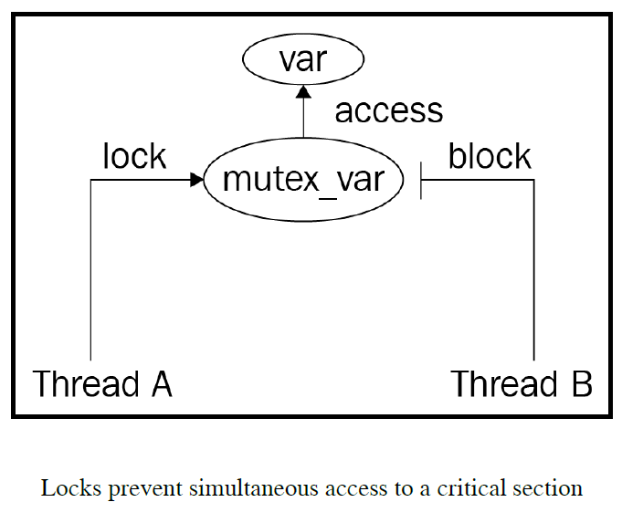

Now, we will specify that, in order to gain access to a critical section in a concurrent program, a thread or process needs to acquire a lock object that is associated with the critical section; similarly, that thread or process also needs to release that lock upon leaving the critical section. This setup will effectively prevent multiple accesses to the critical section, and will therefore prevent race conditions. The following diagram illustrates the execution flow of multiple threads interacting with multiple critical sections, with the implementation of locks in place:

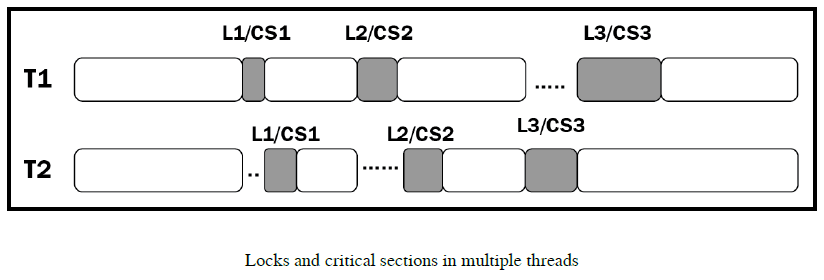

As you can see in the diagram, threads T1 and T2 both interact with three critical sections in their respective execution instructions: CS1, CS2, and CS3. Here, T1 and T2 attempt to access CS1 at almost the same time, and, since CS1 is protected with lock L1, only T1 is able to acquire lock L1, and hence, access/interact with the critical section, while T2 has to spend time waiting for T1 to exit out of the critical section and release the lock before accessing the section itself. Similarly, for the critical sections, CS2 and CS3, although both threads require access to a critical section at the same time, only one can process it, while the other has to wait to acquire the lock associated with the critical section.

## Implementation in Python

Now, let's implement the specification in the preceding example, in order to solve the problem of race conditions.

```Python
import random
import time
import threading


def update():
  global counter

  with count_lock:
    current_counter = counter
    time.sleep(random.randint(0, 1))
    counter = current_counter + 1
```

You can see that all of the execution instructions of a thread specified in the update() function are under the context manager of a lock object named count_lock. So, every time a thread is called to run the function, it will have to first acquire the lock object, before any instructions can be executed. In our main program, we simply create the lock object in addition to what we already had, as follows:

```Python
counter = 0
count_lock = threading.Lock()

threads = [threading.Thread(target=update) for _ in range(20)]

for thread in threads:
  thread.start()
for thread in threads:
  thread.join()

print("Final counter: {0}".format(counter))
print("Finished.")
```

Run the program, and your output should look similar to the following:

```bash
Final counter: 20.
Finished.
```

You can see that the counter was successfully incremented twenty times and held the correct value at the end of the program. Furthermore, no matter how many times the script is executed, the final value of the counter will always be 20. This is the advantage of using locks to implement critical sections in your concurrent programs.

## The downside of locks

In Chapter 12, Deadlock, we covered an interesting phenomenon, in which the use of locks can lead to undesirable results. Specifically, we found out that, with enough locks implemented in a concurrent program, the whole program can become sequential. Let's analyze this concept with our current program

```Python
import threading
import random
import time

random.seed(0)


def update(pause_period):
  global counter

  with count_lock:
    current_counter = counter
    time.sleep(pause_period)
    counter = current_counter + 1


pause_periods = [random.randint(0, 1) for _ in range(20)]

counter = 0
count_lock = threading.Lock()

start = time.perf_counter()
for i in range(20):
  update(pause_periods[i])

print("--Sequential version--")
print("Final counter: {0}".format(counter))
print("Took {0:.2f} seconds.".format(time.perf_counter() - start))

counter = 0
threads = [threading.Thread(target=update, args=(pause_periods[i],)) for i in range(20)]

start = time.perf_counter()
for thread in threads:
  thread.start()
for thread in threads:
  thread.join()

print("--Concurrent version--")
print("Final counter: {0}".format(counter))
print("Took {0:.2f} seconds.".format(time.perf_counter() - start))

print("Finished.")
```

## Turning a concurrent program sequential

The goal of this script is to compare the speed of our current concurrent program with its sequential version. Here, we are still using the same update() function, with locks, and we are running it twenty times, both sequentially and concurrently, like we did earlier. We are also creating a list of determined periods of pausing, so that these periods are consistent between when we simulate the sequential version and when we simulate the concurrent version (for this reason, the update() function now takes in a parameter that specifies the period of pausing each time it is called):

```Python
pause_periods = [random.randint(0, 1) for _ in range(20)]
```

During the next step of the program, we simply call the update() function inside a for loop, with twenty iterations, keeping track of the time it takes for the loop to finish. Note that, even though this is to simulate the sequential version of the program, the update() function still needs the lock object to be created prior, so we are initializing it here:

```Python
counter = 0
count_lock = threading.Lock()

start = time.perf_counter()
for i in range(20):
  update(pause_periods[i])

print("--Sequential version--")
print("Final counter: {0}".format(counter))
print("Took {0:.2f} seconds.".format(time.perf_counter() - start))
```

The last step is to reset the counter and run the concurrent version of the program that we already implemented. Again, we need to pass in the corresponding pause period while initializing each of the threads that run the update() function. We are also keeping track of the time it takes for this concurrent version of the program to run:

```Python
counter = 0
threads = [threading.Thread(target=update, args=(pause_periods[i],)) for i in range(20)]

start = time.perf_counter()
for thread in threads:
  thread.start()
for thread in threads:
  thread.join()

print("--Concurrent version--")
print("Final counter: {0}".format(counter))
print("Took {0:.2f} seconds.".format(time.perf_counter() - start))

print("Finished.")
```

Now, after you have run the script, you will observe that both the sequential version and the concurrent version of our program took the same amount of time to run. Specifically, the following is the output that I obtained; in this case, they both took approximately 12 seconds. The actual time that your program takes might be different, but the speed of the two versions should still be equal:

```bash
--Sequential version--
Final counter: 20.
Took 12.03 seconds.
--Concurrent version--
Final counter: 20.
Took 12.03 seconds.
Finished.
```

So, our concurrent program is taking just as much time as its sequential version, which negates one of the biggest purposes of implementing concurrency in a program: improving speed. But why would concurrent and traditional sequential applications with the same sets of instructions and elements also have the same speed? Should the concurrent program always produce a faster speed than the sequential one?

Recall that, in our program, the critical section is being protected by a lock object, and no multiple threads can access it at the same time. Since all of the execution of the program (incrementing the counter for twenty times) depends on a thread accessing the critical section, the placement of the lock object on the critical section means that only one thread can be executing at a given time. With this specification, the executions of any two threads cannot overlap with each other, and no additional speed can be gained from this implementation of concurrency.

This is the phenomenon that we encountered when analyzing the problem of deadlock: if enough locks are placed in a concurrent program, that program will become entirely sequential. This is a reason why locks are sometimes undesirable solutions to problems in concurrent programming. However, this situation only happens if all of the execution of the concurrent program is dependent upon interacting with the critical section. Most of the time, reading and manipulating the data of a shared resource is only a portion of the entire program and, therefore, concurrency still provides the intended additional speed for our program.

## Locks do not lock anything

An additional aspect of locks is the fact that they do not actually lock anything. The only way that a lock object is utilized, with respect to a specific shared resource, is for the threads and processes interacting with that resource to also interact with the lock. In other words, if those threads and processes choose to not check with the lock before accessing and altering the shared resource, the lock object itself cannot stop them from doing so.

In our examples, you have seen that, to implement the acquiring/releasing process of a lock object, the instructions of a thread or process will be wrapped around by a lock context manager; this specification is dependent on the implementation of the thread/process execution logic and not the resource. That is because the lock objects that we have seen are not connected to the resources that they are supposed to protect in any way. So, if the thread/process execution logic does not require any interaction with the lock object associated with the shared resource, that thread or process can simply gain access to the resource without difficulty, potentially resulting in the mismanipulation and corruption of data.

This is not only true in the scope of having multiple threads and processes in a single concurrent program. Suppose that we have a concurrent system consisting of multiple components that all interact and manipulate the data of a resource shared across the system, and this resource is associated with a lock object; it follows that, if any of these components fail to interact with that lock, it can simply bypass the protection implemented by the lock and access the shared resource. More importantly, this characteristic of locks also has implications regarding the security of a concurrent program. If an outside, malicious agent is connected to the system (say, a malicious client interacting with a server) and intends to corrupt the data shared across the system, that agent can be instructed to simply ignore the lock object and access that data in an intrusive way.

The view that locks don't lock anything was popularized by Raymond Hettinger, a Python core developer who worked on the implementation of various elements in Python concurrent programming. It is argued that using lock objects alone does not guarantee a secure implementation of concurrent data structures and systems. Locks need to be concretely linked to the resources that they are to protect, and nothing should be able to access a resource without first acquiring the lock that is associated with it. Alternatively, other concurrent synchronization tools, such as atomic message queues, can provide a solution to this problem.

## Race conditions in real life

You have now learned about the concept of race conditions, how they are caused in concurrent systems, and how to effectively prevent them. In this section, we will provide an overarching view of how race conditions can occur in real-life examples, within the various sub-fields of computer science. Specifically, we will be discussing the topics of security, file management, and networking.

## Security

Concurrent programming can have significant implications in terms of the security of the system in question. Recall that a race condition arises between the process of reading and altering the data of a resource; a race condition in an authenticating system can cause the corruption of data between the time of check (when the credentials of an agent are checked) and the time of use (when the agent can utilize the resource). This problem is also known as a Time-Of-Check-To-Time-Of-Use (TOCTTOU) bug, which is undoubtedly detrimental to security systems.

Careless protection of shared resources when handling race conditions, as we briefly touched upon during the last section, can provide external agents with access to those supposedly protected resources. Those agents can then change the data of the resources to create privilege escalation (in simple terms, to give themselves more illegal access to more shared resources), or they can simply corrupt the data, causing the whole system to malfunction.

Interestingly, race conditions can also be used to implement computer security. As race conditions result from the uncoordinated access of multiple threads/processes to a shared resources, the specification in which a race condition occurs is significantly random. For example, in our own Python example, you saw that, when simulating a race condition, the final value of the counter varies between different executions of the program; this is (partly) because of the unpredictable nature of the situation, in which multiple threads are running and accessing the shared resources. (I say partly, since the randomness also results from the random pausing periods that we generate in each execution of the program.) So, race conditions are sometimes intentionally provoked, and the information obtained when the race condition occurs can be used to generate digital fingerprints for security processes—this information, again, is significantly random, and is therefore valuable for security purposes.

## Operating systems

Race conditions can occur in the context of file and memory management in an operating system, when two separate programs attempt to access the same resource, such as memory space. Imagine a situation where two processes from different programs have been running for a significant amount of time, and, even though they were originally initialized apart from each other in terms of memory space, enough data has been accumulated and the stack of execution of one process now collides with that of the other process. This can lead to the two processes sharing the same portion of memory space and can ultimately result in unpredictable consequences.

Another aspect of the complexity of race conditions is illustrated by the Unix version 7 operating system—specifically, in the mkdir command. Typically, the mkdir command is used to create a new directory in the Unix operating system; this is done by calling the mknod command to create the actual directory and the chown command to specify the owner of that directory. Because there are two separate commands to be run and a definite gap exists between when the first command is finished and the second is called, this can cause a race condition.

During the gap between the two commands, if someone can delete the new directory created by the mknod command and link the reference to another file, when the chown command is run, the ownership of that file will be changed. By exploiting this vulnerability, someone can theoretically change the ownership of any file in an operating system so that someone can create a new directory. The following diagram further illustrates this exploitation:

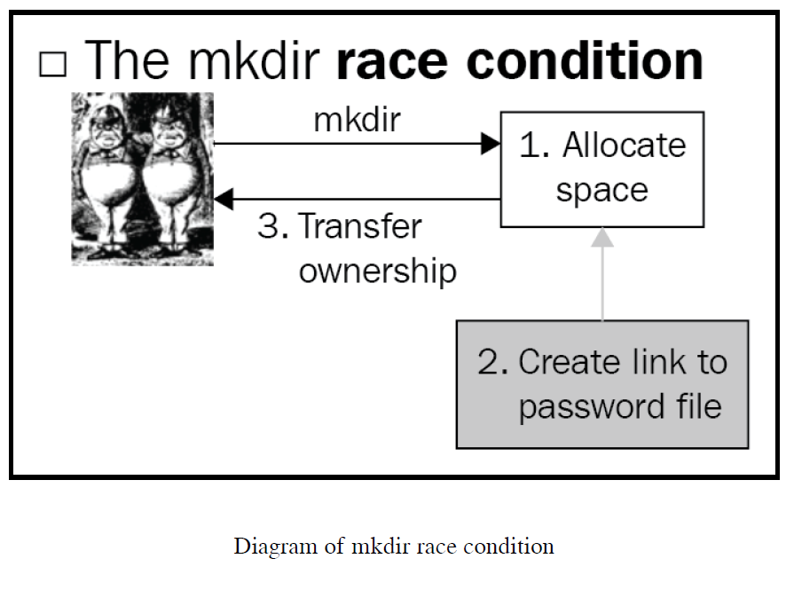

## Networking

In networking, race conditions can take the form of giving multiple users unique privileges in a network. Specifically, say a given server should only have exactly one user with admin privileges. If two users, who are both eligible to become the server admin, request access to those privileges at the same time, then it is possible for both of them to gain that access. This is because, at the point when both of the user requests are received by the server, neither of the users have been granted admin privileges yet, and the server thinks that admin privileges can still be given out.

This form of a race condition is quite common when a network is highly optimized for parallel processing (for example, non-blocking sockets), without a careful consideration of the resources shared across the network

# 15. The Global Interpreter Lock

## An introduction to the Global Interpreter Lock

The GIL is quite popular in the Python concurrent programming community. Designed as a lock that will only allow one thread to access and control the Python interpreter at any given time, the GIL in Python is often known as the infamous GIL that prevents multithreaded programs from reaching their fully optimized speed.

## An analysis of memory management in Python

Before we jump into the specifics of the GIL and its effects, let's consider the problems that Python core developers encountered during the early days of Python, and that gave rise to a need for the GIL. Specifically, there is a significant difference between Python programming and programming in other popular languages, in terms of managing objects in the memory space.

For example, in the programming language C++, a variable is actually a location in the memory space where a value will be written. This setup leads to the fact that, when a nonpointer variable is assigned with a specific value, the programming language will effectively copy that specific value to the memory location (that is, the variable). Additionally, when a variable is assigned with another variable (which is not a pointer), the memory location of the latter will be copied to that of the former; no further connection between these two variables will be maintained after the assignment.

On the other hand, Python considers a variable as simply a name, while the actual values of its variables are isolated in another region in the memory space. When a value is assigned to a variable, the variable is effectively given a reference to the location in the memory space of the value (even though the term referencing is not used in the same sense as C++ referencing). Memory management in Python is therefore fundamentally different from the model of putting a value into a memory space that we see in C++.

This means that when an assignment instruction is executed, Python simply interacts with references and switches them around—not the actual values themselves. Also, for this reason, multiple variables can be referenced by the same value, and the changes made by one variable will be reflected throughout all of the other associated variables.

```Python
import sys

print("Reference count when direct-referencing: {0}".format(sys.getrefcount([7])))

a = [7]
print("Reference count when reference once: {0}".format(sys.getrefcount(a)))

b = a
print("Reference count when reference twice: {0}".format(sys.getrefcount(a)))

a[0] = 8
print("Variable a after a is changed: {0}".format(a))
print("Variable b after a is changed: {0}".format(b))

print("Finished.")
```

In this example, we are looking at the management of the value [7] (a list of one element: the integer 7). We mentioned that values in Python are stored independently of variables, and value management in Python simply references variables to the appropriate values. The sys.getrefcount() method in Python takes in an object and returns the counter of all references that the value associated to that object has. Here, we are calling sys.getrefcount() three times: on the actual value, [7]; the variable a that is assigned with the value; and finally, the variable b that is assigned with the variable a.

Additionally, we are exploring the process of mutating the value by using a variable referenced with it and the resulting values of all of the variables associated to that value. Specifically, we are mutating the first element of the list via variable a, and printing out the values of both a and b. Run the script, and your output should be similar to the following:

```bash
Reference count when direct-referencing: 1.
Reference count when referenced once: 2.
Reference count when referenced twice: 3.
Variable a after a is changed: [8].
Variable b after a is changed: [8].
Finished.
```

As you can see, this output is consistent with what we discussed: for the first sys.getrefcount() function call, there is only one reference count for the value [7], which is created when we directly reference it; when we assign the list to variable a, the value has two references, since a is now associated with the value; finally, when a is assigned to b, [7] is additionally referenced by b, and the reference count is now three.

In the output of the second part of the program, we can see that, when we changed the value of which variable a references, [7] was mutated instead of the variable a. As a result, variable b, which was referencing the same value as a, also had its value changed.

The following diagram illustrates this process. In Python programs, variables (a and b) simply make references to the actual values (objects), and an assignment statement between two variables (for example, a = b) instructs Python to have the two variables reference the same object (as opposed to copying the actual value to another memory location, like in C++):

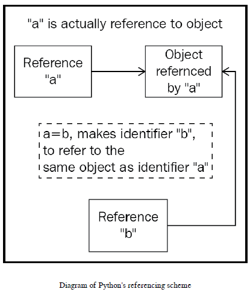

## The problem that the GIL addresses

Keeping Python's implementation of memory and variable management in mind, we can see that references to a given value in Python are constantly changing in a program, and keeping track of the reference count for a value is therefore highly important.

Now, applying what you learned in Chapter 14, Race Conditions, you should know that in a Python concurrent program, this reference count is a shared resource that needs protection from race conditions. In other words, this reference count is a critical section, which, if handled carelessly, will result in an incorrect interpretation of how many variables are referencing a particular value. This will cause memory leaks that will make Python programs significantly inefficient, and may even release a memory that is actually being referenced by some variables, losing that value forever.

As you learned in the previous chapter, a solution to making sure that race conditions will not occur with regard to a particular shared resource is to place a lock on that resource, effectively allowing one thread, at the most, to access the resource at any given time within a concurrent program. We also discussed that, if enough locks are placed in a concurrent program, that program will become entirely sequential, and no additional speed will be gained by implementing concurrency.

The GIL is a solution to the combination of the two preceding problems, being one single lock on the entire execution of Python. The GIL must first be acquired by any Python instruction that wants to be executed (CPU-bound tasks), preventing a race condition from occurring for any reference count.

In the early days of the development of the Python language, other solutions to the problem described here were also proposed, but the GIL was the most efficient and simple to implement, by far. Since the GIL is a lightweight, overarching lock for the entire execution of Python, no other lock needs to be implemented to guarantee the integrity of other critical sections, keeping the performance overhead of Python programs at a minimum.

## Problems raised by the GIL

Intuitively, with a lock guarding all CPU-bound tasks in Python, a concurrent program will not be able to become fully multithreading. The GIL effectively prevents CPU-bound tasks from being executed in parallel across multiple threads. To understand the effect of this feature of the GIL, let's consider an example in Python:

```Python
import time
import threading

COUNT = 50000000


def countdown(n):
  while n > 0:
    n -= 1


start = time.perf_counter()
countdown(COUNT)

print("Sequential program finished.")
print("Took {0:.2f} seconds.".format(time.perf_counter() - start))

thread1 = threading.Thread(target=countdown, args=(COUNT // 2,))
thread2 = threading.Thread(target=countdown, args=(COUNT // 2,))

start = time.perf_counter()
thread1.start()
thread2.start()
thread1.join()
thread2.join()

print("Concurrent program finished.")
print("Took {0:.2f} seconds".format(time.perf_counter() - start))
```

In this example, we are comparing the speed of executing a particular program in Python sequentially and concurrently, via multithreading. Specifically, we have a function named countdown() that simulates a heavy CPU-bound task, which takes in a number, n, and decrements it until it becomes zero or negative. We then call countdown() on 50,000,000 once, as a sequential program. Finally, we call the function twice, each in a separate thread, on 25,000,000, which is exactly half of 50,000,000; this is the multithreading version of the program. We are also keeping track of the time it takes for Python to run both the sequential program and the multithreading program.

Theoretically, the multithreading version of the program should take half as long as the sequential version, as the task is effectively being split in half and run in parallel, via the two threads that we created. However, the output produced by the program would suggest otherwise. The following output is what I obtained through running the script:

```bash
Sequential program finished.
Took 2.80 seconds.
Concurrent program finished.
Took 2.74 seconds.
```

Contrary to what we predicted, the concurrent version of the countdown took almost as long as the sequential version; multithreading did not offer any considerable speedup for our program. This is a direct effect of having the GIL guarding CPU-bound tasks, as multiple threads are not allowed to run simultaneously. Sometimes, a multithreading program can take even longer to complete its execution than its sequential counterpart, since there is also the overhead of acquiring and releasing the GIL.

This is undoubtedly a significant problem for multithreading, and for concurrent programming in Python in general, because as long as a program contains CPU-bound instructions, those instructions will, in fact, be sequential in the execution of the program. However, instructions that are not CPU-bound happen outside the GIL, and thus, they are not affected by the GIL (for example, I/O-bound instructions).

## The potential removal of the GIL from Python

You have learned that the GIL sets a significant constraint on our multithreading programs in Python, especially those with CPU-bound tasks. For this reason, many Python developers have come to view the GIL in a negative light, and the term "the infamous GIL" has started to become popular; it is not surprising that some have even advocated the complete removal of the GIL from the Python language.

In fact, multiple attempts to remove the GIL have been made by prominent Python users. However, the GIL is so deeply implanted in the implementation of the language, and the execution of most libraries and packages that are not thread-safe is so significantly dependent on the GIL, that the removal of the GIL will actually engender bugs as well as backward incompatibility issues for your Python programs. A number of Python developers and researchers tried to completely omit the GIL from Python execution, and most existing C extensions, which depend heavily on the functionalities of the GIL, stopped working.

Now there are other viable solutions to address the problems that we have discussed; in other words, the GIL is in every way replaceable. However, most of these solutions contain so many complex instructions that they actually decrease the performance of sequential and I/O-bound programs, which are not affected by the GIL. So, these solutions will slow down single-threaded or multithreaded I/O programs, which actually make up a large percentage of existing Python applications. Interestingly, the creator of Python, Guido van Rossum, also commented on this topic in his article, It isn't Easy to Remove the GIL:

> "I'd welcome a set of patches into Py3k only if the performance for a single-threaded program (and for a multi-threaded but I/O-bound program) does not decrease."

Unfortunately, this request has not been achieved by any of the proposed alternatives to the GIL. The GIL remains an integral part of the Python language.

## How to work with the GIL

There are a few ways to deal with the GIL in your Python applications, which will be addressed as follows.

## Implementing multirpcoessing, rather than multithreading

This is perhaps the most popular and easiest method to circumvent the GIL and achieve optimal speed in a concurrent program. As the GIL only prevents multiple threads from executing CPU-bound tasks simultaneously, processes executing over multiple cores of a system, each having its own memory space, are completely immune to the GIL.

```Python
import time
import threading
from multiprocessing import Pool

COUNT = 50000000

def countdown(n):
  while n > 0:
    n -= 1

if __name__ == '__main__':
  start = time.perf_counter()
  countdown(COUNT)

  print("Sequential program finished.")
  print("Took {0:.2f} seconds.".format(time.perf_counter() - start))
  print()

  thread1 = threading.Thread(target=countdown, args=(COUNT // 2, ))
  thread2 = threading.Thread(target=countdown, args=(COUNT // 2,))

  start = time.perf_counter()

  thread1.start()
  thread2.start()

  thread1.join()
  thread2.join()

  print("Multithreading program finished.")
  print("Took {0:.2f} seconds".format(time.perf_counter() - start))
  print()

  pool = Pool(processes=2)
  start = time.perf_counter()
  pool.apply_async(countdown, args=(COUNT//2, ))
  pool.apply_async(countdown, args=(COUNT // 2,))
  pool.close()
  pool.join()

  print("Multiprocessing program finished.")
  print("Took {0:.2f} seconds".format(time.perf_counter() - start))
```

After running the program, my output was as follows:

```bash
Sequential program finished.
Took 2.95 seconds.

Multithreading program finished.
Took 2.69 seconds.

Multiprocessing program finished.
Took 1.54 seconds.
```

There is still a minimal difference in speed between the sequential and multithreading versions of the program. However, the multiprocessing version was able to cut that speed by almost half in its execution; as discussed in earlier chapters; since processes are fairly heavy weight, multiprocessing instructions contain significant overhead, which is the reason why the speed of the multiprocessing program was not exactly half of the sequential program.

## Getting around the GIL with native extensions

There are Python native extensions that are written in C/C++, and are therefore able to avoid the limitations that the GIL sets out; one example is the most popular Python scientific computing package, NumPy. Within these extensions, manual releases of the GIL can be made, so that the execution can simply bypass the lock. However, these releases need to be implemented carefully and accompanied by the reassertion of the GIL before the execution goes back to the main Python execution.

## Utilizing a different Python interpreter

The GIL only exists in CPython, which is the most common interpreter for the language by far, and is built in C. However, there are other interpreters for Python, such as Jython (written in Java) and IronPython (written in C++), that can be used to avoid the GIL and its affects on multithreading programs. Keep in mind that these interpreters are not as widely used as CPython, and some packages and libraries might not be compatible with one or both of them

# 16. Designing Lock-Based and Mutex-Free Concurrent Data Structures

\-

# 17. Memory Models and Operators on Atomic Types

## The components of Python memory manager

Data in Python is stored in memory in a particular way. To gain an in-depth understanding on a high level, regarding how data is handled in concurrent programs, we first need to dive deep into the theoretical structure of Python memory allocation. In this section, we will discuss how data is allocated in a private heap, and the handling of this data via the Python memory manager—an overarching entity that ensures the integrity of the data.

The Python memory manager consists of a number of components that interact with different entities and support different functionalities. For example, one component handles the allocation of memory at a low level by interacting with the memory manager of the operating system that Python is running on; it is called the raw memory allocator.

On the higher levels, there are also a number of other memory allocators that interact with the aforementioned private heap of objects and values. These components of the Python memory manager handle object-specific allocations that execute memory operations that are specific to the given data and object types: integers have to be handled and managed by a different allocator to one that manages strings, or one for dictionaries or tuples. As storing and reading instructions varies between these data types, these different object-specific memory allocators are implemented to gain additional speed while sacrificing some processing space.

One step lower than the aforementioned raw memory allocator are the system allocators from the standard C library (assuming that the Python interpreter under consideration is CPython). Sometimes known as general-purpose allocators, these written-in-C entities are responsible for helping the raw memory allocator interact with the memory manager of the operating system.

The entire model of the Python memory manager described previously can be illustrated by the following diagram:

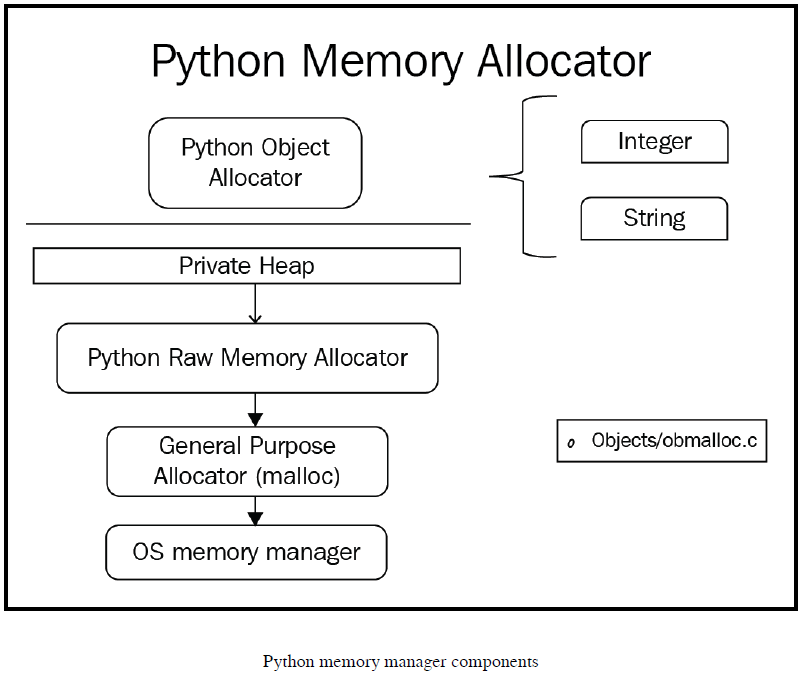

## Memory model as a labeled directed graph

We have learned about the general process of memory allocation in Python, so in this section, let's think about how data is stored and referenced in Python. Many programmers often think about the memory model in Python as one object graph with a label at each node and the edges are directed—in short, it is a labeled directed object graph. This memory model was first put into use with the second oldest computer programming language, Lisp (previously known as LISP).

It is often thought of as a directed graph because its memory model keeps track of its data and variables via nothing but pointers: the value of every variable is a pointer, and this point can be pointing to a symbol, a number, or a subroutine. So, these pointers are the directed edges in the object graph, and the actual values (symbols, numbers, subroutines) are the nodes in the graph. The following diagram is a simplification of the Lisp memory model in its early stages:

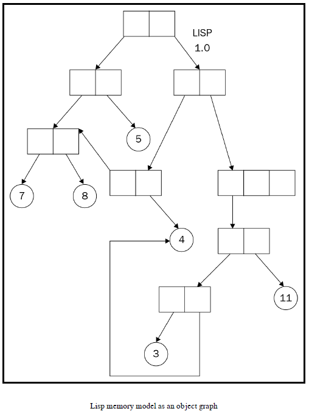

With this object-graph memory model come a number of advantageous characteristics for memory management. First of all, the model offers a significant degree of flexibility in terms of reusability; it is possible, and in fact quite easy, to write a data structure or a set of instructions for one kind of data type or object and then also reuse it on other kinds. In contrast, C is a programming language that utilizes a different memory model that does not offer this flexibility, and its programmers are usually required to spend a significant amount of time rewriting the same data structures and algorithms for different kinds of data types and objects.

Another form of flexibility that this memory model provides is the fact that every object can be referenced by any number of pointers (or ultimately variables) and therefore be mutated by any of them. We have already seen the effect of this characteristic in a sample Python program in Chapter 15, The Global Interpreter Lock, if two variables reference the same (mutable) object (achieved when one variable is assigned to another) and one successfully mutates the object via its reference, then the change will also be reflected through the reference of the second variable.

As also discussed in Chapter 15, The Global Interpreter Lock, this is not similar to the memory management in C++. For example, as when a variable (that is not a pointer or a reference) is assigned with a specific value, the programming language will copy that specific value to the memory location that contains the original variable. Additionally, when a variable is assigned with another variable, the memory location of the latter will be copied to that of the former; no further connection between these two variables is maintained after the assignment.

However, some argue that this can, in fact, be a disadvantage in programming, especially concurrent programming, as uncoordinated attempts to mutate a shared object can lead to undesirable results. As experienced Python programmers, you might have also noticed that type errors (when a variable expected to be one specific type is referencing an object of a different, noncompatible type) are quite common in Python programming. This is also a direct result of this memory model, because, again, a reference pointer can point to anything.

## In the context of concurrency

With the theoretical basics of the Python memory model in mind, how can we expect it to affect the ecosystem of Python concurrent programming? Fortunately, the Python memory model works in favor of concurrent programming in the sense that it allows thinking and reasoning about concurrency that is easier and more intuitive. Specifically, Python implements its memory model and executes its program instructions in the same way that we conventionally expect it to.

To understand this advantage that Python possesses, let's first consider concurrency in the Java programming language. To achieve better performance in terms of speed in concurrent programs (specifically multithreading programs), Java allows CPUs to rearrange the order in which given operations included in Java code are to be executed. The rearrangement, however, is made in an arbitrary way so that we cannot easily reason the order of execution from just the sequential ordering of the code when multiple threads are executing. This leads to the fact that if a concurrent program in Java executes in a way that is not intended, the developer would need to spend a significant amount of time determining the order of execution of the program to pinpoint the bug in their program.

Unlike Java, Python has its memory model structured in a way that maintains the sequential consistency of its instructions. This means that the order in which the instructions are arranged in the Python code specifies the order of their execution—no arbitrary rearrangement of the code and, therefore, no surprising behavior from the concurrent programs. However, since the rearrangement in Java concurrency is implemented in order to achieve better speed for the programs, this means that Python is sacrificing its performance to keep its execution simpler and more intuitive.

## Atomic operations in Python

Another important topic regarding memory management is atomic operations. In this subsection, we will be exploring the definition of being atomic in programming, the roles that atomic operations have in the context of concurrent programming, and finally how to use atomic operations in Python programs.

## What does it mean to be atomic?

Let's first examine the actual characteristic of being atomic. If an operation is atomic in a concurrent program, then it cannot be interrupted by other entities in the program during its execution; an atomic operation can also be called linearizable, indivisible, or uninterruptible. Given the nature of race conditions and how common they are in concurrent programs, it is quite intuitive to conclude that atomicity is a desirable characteristic of a program, as it guarantees the integrity of the shared data, and protects it from uncoordinated mutations.

The term "atomic" refers to the fact that an atomic operation appears instantaneous to the rest of the program that it is in. This means that the operation has to be executed in a continuous, uninterrupted manner. The most common method of implementing atomicity, as you could probably guess, is via mutual exclusion, or locks. Locks, as we have seen, require interactions with a shared resource to take place one thread or process at a time, thus protecting those interactions of one thread/process from being interrupted and potentially corrupted by other competing threads or processes.

If a programmer allows some of the operations in their concurrent program to be nonatomic, they would also need to allow those operations to be careful and flexible (in the sense of interacting and mutating data) enough so that no errors should result from them being interrupted by other operations. If, however, irregular and erroneous behaviors were to take place when these operations are interrupted during their execution, it would be quite difficult for the programmer to actually reproduce and debug those behaviors.

## The GIL reconsidered

One of the major elements in the context of Python atomic operations is, of course, the GIL; there are additionally common misconceptions as well as complexities regarding the role the GIL plays in atomic operations.

For example, as reading about the definition of atomic operations, some tend to argue that all operations in Python are actually atomic, as the GIL actually requires threads to execute in a coordinated manner, with only one being able to run at any given point. This is, in fact, a false statement. The requirement of the GIL that only one thread can execute Python code at a given time does not lead to the atomicity of all Python operations; one operation can still be interrupted by another, and errors can still result from the mishandling and corruption of shared data.

At a lower level, the Python interpreter handles the switching between threads in a Python concurrent program. This process is done with respect to bytecode instructions, which are compiled Python code that are interpretable and executable by machines. Specifically, Python maintains a fixed frequency specifying how often the interpreter should switch between one active thread to another and this frequency can be set using the built-in sys.setswitchinterval() method. Any nonatomic operation can be interrupted during its execution by this thread switching event.

In Python 2, the default value for this frequency is 1,000 bytecode instructions, which means that after a thread has successfully executed 1,000 bytecode instructions, the Python interpreter will look for other active threads that are waiting to be executed. If there is at least one other waiting thread, the interpreter will have the currently running thread to release the GIL and have the waiting thread acquire it and thus start the execution of the latter thread.

In Python 3, the frequency is fundamentally different. The unit used for the frequency is now time-based, specifically in seconds. With the default value of 15 milliseconds, this frequency specifies that if a thread has been executing for at least the amount of time equal to the threshold, then the thread switching event (together with the releasing and acquiring of the GIL) will take place as soon as the thread finishes the execution of the current bytecode instruction.

## Innate atomicity in Python

As mentioned previously, an operation can be interrupted during its execution if the thread executing it has passed its executing limit (for example, 15 milliseconds in Python 3 by default), at which point the operation has to finish its current bytecode instruction and give back the GIL to another thread that is waiting. This means that the thread-switching event only takes place between bytecode instructions.

There are operations in Python that can be executed in one single bytecode instruction and are therefore atomic in nature without the help of external mechanisms, such as mutual exclusion. Specifically, if an operation in a thread completes its execution in one single bytecode, it cannot be interrupted by the thread-switching event as the event only takes place after the current bytecode instruction is completed. This characteristic of innate atomicity is very useful, as it allows the operations that have it to execute their instructions freely even if no synchronization method is being utilized, while still guaranteeing that they will not be interrupted and have their data corrupted.

## Atomic versus nonatomic

It is important to note that it can be surprising for programmers to learn which operations in Python are atomic and which are not. Some might assume that since simple operations take less bytecode than complex ones, the simpler an operation is, the more likely it is to be innately atomic. However, this is not the case, and the only way to determine with certainty which operations are atomic in nature is to perform further analyses.

According to the documentation of Python 3, some examples of innately atomic operations include the following:

* Appending a predefined object to a list

* Extending a list with another list

* Fetching an element from a list

* "Popping" from a list

* Sorting a list

* Assigning a variable to another variable

* Assigning a variable to an attribute of an object

* Creating a new entry for a dictionary

* Updating a dictionary with another dictionary

Some operations that are not innately atomic include the following:

* Incrementing an integer, including using +=

* Updating an element in a list by referencing another element in that list

* Updating an entry in a dictionary via referencing another entry in that dictionary

## Simulation in Python

```Python
import threading
import sys

sys.setswitchinterval(.000001)


def foo():
  global n
  n += 1


n = 0

threads = []

for i in range(1000):
  thread = threading.Thread(target=foo)
  threads.append(thread)

for thread in threads:
  thread.start()
for thread in threads:
  thread.join()

print("Final value: {0}.".format(n))
print("Finished.")
```

First of all, we are resetting the thread-switching frequency of the Python interpreter to 0.000001 seconds—this is to have the thread switching event take place more often than usual and thus amplify any race condition that might be in our program.

The gist of the program is to increment a simple global counter (n) with 1,000 separate threads, each incrementing the counter once via the foo() function. Since the counter was originally initialized as 0, if the program executed correctly, we would have that counter holding the value of 1,000 at the end of the program. However, we know that the increment operator that we are using in the foo() function (+=) is not an atomic operation, which means it can be interrupted by a thread-switching event when applied on a global variable.

After running the script multiple times, we can observe that there is, in fact, a race condition existing in our code. This is illustrated by incorrect values of the counter that are less than 1,000. For example, the following is an output I obtained:

```bash
Final value: 1000.
Finished.
```

This is consistent with what we have previously discussed, that is, since the += operator is not atomic, it would need other synchronization mechanisms to ensure the integrity of the data that it interacts with from multiple threads concurrently. Let's now simulate the same experiment with an operation that we know is atomic, specifically appending a predefined object to a list.

```Python
import threading
import sys

sys.setswitchinterval(.000001)


def foo():
  global my_list
  my_list.append(1)


my_list = []

threads = []

for i in range(1000):
  thread = threading.Thread(target=foo)
  threads.append(thread)

for thread in threads:
  thread.start()
for thread in threads:
  thread.join()

print("Final list length: {0}.".format(len(my_list)))
print("Finished.")
```

Instead of a global counter, we now have a global list that was originally empty. The new foo() function now takes this global list and appends the integer 1 to it. In the rest of the program, we are still creating and running 1,000 separate threads, each of which calls the foo() function once. At the end of the program, we will print out the length of the global list to see if the list has been successfully mutated 1,000 times. Specifically, if the length of the list is less than 1,000, we will know that there is a race condition in our code, similar to what we saw in the previous example.

As the list.append() method is an atomic operation, however, it is guaranteed that there is no race condition when the threads call the foo() function and interact with the global list. This is illustrated by the length of the list at the end of the program. No matter how many times we run the program, the list will always have a length of 1,000:

```bash
Final list length: 1000.
Finished.
```

Even though some operations in Python are innately atomic, it can be quite difficult to tell whether a given operation is atomic on its own or not. Since the application of nonatomic operations on shared data can lead to race conditions and thus erroneous results, it is always recommended that programmers utilize synchronization mechanisms to ensure the integrity of the shared data within a concurrent program