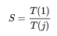

# Mastering Concurrency in Python by Quan Nguyen

## 1. Advanced Introduction to Concurrent and Parallel Programming
## 2. Amdahl's Law
## 3. Working with Threads in Python
## 4. Using the with Statement in Threads
## 5. Concurrent Web Requests
## 6. Working with Processes in Python
## 7. Reduction Operators in Processes
## 8. Concurrent Image Processing
## 9. Introduction to Asynchronous Programming
## 10. Implementing Asynchronous Programming in Python
## 11. Building Communication Channels with asyncio
## 12. Deadlocks
## 13. Starvation
## 14. Race Conditions
## 15. The Global Interpreter Lock
## 16. Designing Lock-Based and Mutex-Free Concurrent Data Structures
## 17. Memory Models and Operators on Atomic Types
## 18. Building a Server from Scratch
## 19. Testing, Debugging, and Scheduling Concurrent Applications

---

---

# 1. Advanced Introduction to Concurrent and Parallel Programming

## Concurrent versus sequential

Perhaps the most obvious way to understand concurrent programming is to compare it to sequential programming. While a sequential program is in one place at a time, in a concurrent program, different components are in independent, or semi-independent, states. This means that components in different states can be executed independently, and therefore at the same time (as the execution of one component does not depend on the result of another). The following diagram illustrates the basic differences between these two types:


One immediate advantage of concurrency is an improvement in execution time. Again, since some tasks are independent and can therefore be completed at the same time, less time is required for the computer to execute the whole program.

## Concurrent vs parallel

At this point, if you have had some experience in parallel programming, you might be wondering whether concurrency is any different from parallelism. The key difference between concurrent and parallel programming is that, while in parallel programs there are a number of processing flows (mainly CPUs and cores) working independently all at once, there might be different processing flows (mostly threads) accessing and using a shared resource at the same time in concurrent programs.

Since this shared resource can be read and overwritten by any of the different processing flows, some form of coordination is required at times, when the tasks that need to be executed are not entirely independent from one another. In other words, it is important for some tasks to be executed after the others, to ensure that the programs will produce the correct results.


The preceding figure illustrates the difference between concurrency and parallelism: while in the upper section, parallel activities (in this case, cars) that do not interact with each other can run at the same time, in the lower section, some tasks have to wait for others to finish before they can be executed.

We will look at more examples of these distinctions later on.

### A quick metaphor

Concurrency is a quite difficult concept to fully grasp immediately, so let's consider a quick metaphor, in order to make concurrency and its differences from parallelism easier to understand.

Although some neuroscientists might disagree, let's briefly assume that different parts of the human brain are responsible for performing separate, exclusive body part actions and activities. For example, the left hemisphere of the brain controls the right side of the body, and hence, the right hand (and vice versa); or, one part of the brain might be responsible for writing, while another solely processes speaking.

Now, let's consider the first example, specifically. If you want to move your left hand, the right side of your brain (and only the right side) has to process that command to move, which means that the left side of your brain is free to process other information. So, it is possible to move and use the left and right hands at the same time, in order to do different things. Similarly, it is possible to be writing and talking at the same time.

That is parallelism: where different processes don't interact with, and are independent of, each other. Remember that concurrency is not quite like parallelism. Even though there are instances where processes are executed together, concurrency also involves sharing the same resources. If parallelism is similar to using your left and right hands for independent tasks at the same time, concurrency can be associated with juggling, where the two hands perform different tasks simultaneously, but they also interact with the same object (in this case, the juggling balls), and some form of coordination between the two hands is therefore required.

## Not everything should be made concurrent

Not all programs are created equal: some can be made parallel or concurrent relatively easily, while others are inherently sequential, and thus cannot be executed concurrently, or in parallel. An extreme example of the former is embarrassingly parallel programs, which can be divided into different parallel tasks, between which there is little or no dependency or need for communication.

## Inherently Sequential

In opposition to embarrassingly parallel tasks, the execution of some tasks depends heavily on the results of others. In other words, those tasks are not independent, and thus, cannot be made parallel or concurrent. Furthermore, if we were to try to implement concurrency into those programs, it could cost us more execution time to produce the same results.

A concept that is commonly used to illustrate the innate sequentiality of some tasks is pregnancy: the number of women will never reduce the length of pregnancy. As opposed to parallel or concurrent tasks, where an increase in the number of processing entities will improve the execution time, adding more processors in inherently sequential tasks will not. Famous examples of inherent sequentiality include iterative algorithms: Newton's method, iterative solutions to the three-body problem, or iterative numerical approximation methods.

## I/O bound

Another way to think about sequentiality is the concept (in computer science) of a condition called I/O bound, in which the time it takes to complete a computation is mainly determined by the time spent waiting for input/output (I/O) operations to be completed. This condition arises when the rate at which data is requested is slower than the rate at which it is consumed, or, in short, more time is spent requesting data than processing it.

In an I/O bound state, the CPU must stall its operation, waiting for data to be processed. This means that, even if the CPU gets faster at processing data, processes tend to not increase in speed in proportion to the increased CPU speed, since they get more I/O-bound. With faster computation speed being the primary goal of new computer and processor designs, I/O bound states are becoming undesirable, yet more and more common, in programs.

As you have seen, there are a number of situations in which the application of concurrent programming results in decreased processing speed, and they should thus be avoided. It is therefore important for us to not see concurrency as a golden ticket that can produce unconditionally better execution times, and to understand the differences between the structures of programs that benefit from concurrency and programs that do not.

# 2. Amdahl's Law

## Amdahl's Law

How do you find a balance between parallelizing a sequential program (by increasing the number of processors) and optimizing the execution speed of the sequential program itself? For example, which is the better option: Having four processors running a given program for 40% of its execution, or using only two processors executing the same program, but for twice as long? This type of trade-off, which is commonly found in concurrent programming, can be strategically analyzed and answered by applying Amdahl's Law.

Additionally, while concurrency and parallelism can be a powerful tool that provides significant improvements in program execution time, they are not a silver bullet that can speed up any non-sequential architecture infinitely and unconditionally. It is therefore important for developers and programmers to know and understand the limits of the speed improvements that concurrency and parallelism offer to their programs, and Amdahl's Law addresses those concerns.

## Terminology 

Amdahl's Law provides a mathematical formula that calculates the potential improvement in speed of a concurrent program by increasing its resources (specifically, the number of available processors). Before we can get into the theory behind Amdahl's Law, first, we must clarify some terminology, as follows:

* Amdahl's Law solely discusses the potential speedup in latency resulting from executing a task in parallel. While concurrency is not directly discussed here, the results from Amdahl's Law concerning parallelism will nonetheless give us an estimation regarding concurrent programs.
* The speed of a program denotes the time it takes for the program to execute in full. This can be measured in any increment of time.
* Speedup is the time that measures the benefit of executing a computation in parallel. It is defined as the time it takes a program to execute in serial (with one processor), divided by the time it takes to execute in parallel (with multiple processors). The formula for speedup is as follows:



In the preceding formula, T(j) is the time it takes to execute the program when using j processors.

## Formula and interpretation

Before we get into the formula for Amdahl's Law and its implications, let's explore the concept of speedup, through some brief analysis. Let's assume that there are N workers working on a given job that is fully parallelizable—that is, the job can be perfectly divided into N equal sections. This means that N workers working together to complete the job will only take 1/N of the time it takes one worker to complete the same job.

However, most computer programs are not 100% parallelizable: some parts of a program might be inherently sequential, while others are broken up into parallel tasks.

## The formula for Amdahl's Law


## A quick example

Let's assume that we have a computer program, and the following applies to it:

* 40% of it is subject to parallelism, so B = 1 - 40% = 0.6

* Its parallelizable parts will be processed by four processors, so j = 4

Amdahl's Law states that the overall speedup of applying the improvement will be as follows:


## Implications

The following is a quote from Gene Amdahl, in 1967:

> "For over a decade prophets have voiced the contention that the organization of a single computer has reached its limits and that truly significantly advances can be made only by interconnection of a multiplicity of computers in such a manner as to permit cooperative solution... The nature of this overhead (in parallelism) appears to be sequential so that it is unlikely to be amenable to parallel processing techniques. Overhead alone would then place an upper limit on throughput of five to seven times the sequential processing rate, even if the housekeeping were done in a separate processor... At any point in time it is difficult to foresee how the previous bottlenecks in a sequential computer will be effectively overcome."

Through the quote, Amdahl indicated that whatever concurrent and parallel techniques are implemented in a program, the sequential nature of the overhead portion required in the program always sets an upper boundary on how much speedup the program will gain. This is one of the implications that Amdahl's Law further suggests. Consider the following example:


This shows that, as the number of resources (specifically, the number of available processors) increases, the speedup of the execution of the whole task also increases. However, this does not mean that we should always implement concurrency and parallelism with as many system processors as possible, to achieve the highest performance. In fact, from the formula, we can also gather that the speedup achieved from incrementing the number of processors decreases. In other words, as we add more processors for our concurrent program, we will obtain less and less improvement in execution time.

Furthermore, as mentioned previously, another implication that Amdahl's Law suggests concerns the upper limit of the execution time improvement:


## Amdahl's Law's relationship to the law of diminishing returns

Amdahl's Law is often conflated with the law of diminishing returns, which is a rather popular concept in economics. However, the law of diminishing returns is only a special case of applying Amdahl's Law, depending on the order of improvement. If the order of separate tasks in the program is chosen to be improved in an optimal way, a monotonically decreasing improvement in execution time will be observed, demonstrating diminishing returns. An optimal method indicates first applying those improvements that will result in the greatest speedups, and leaving those improvements yielding smaller speedups for later.

Now, if we were to reverse this sequence for choosing resources, in which we improve less optimal components of our program before more optimal components, the speedup achieved through the improvement would increase throughout the process. Furthermore, it is actually more beneficial for us to implement system improvements in this reverseoptimal order in reality, as the more optimal components are usually more complex, and take more time to improve.

Another similarity between Amdahl's Law and the law of diminishing returns concerns the improvement in speedup obtained through adding more processors to a system. Specifically, as a new processor is added to the system to process a fixed-size task, it will offer less usable computation power than the previous processor. As we discussed in the last section, the improvement in this situation strictly decreases as the number of processors increases, and the total throughout approaches the upper boundary of 1/B.

It is important to note that this analysis does not take into account other potential bottlenecks, such as memory bandwidth and I/O bandwidth. In fact, if these resources do not scale with the number of processors, then simply adding processors results in even lower returns

# 3. Working with Threads in Python

## The concept of a thread

In the field of computer science, a thread of execution is the smallest unit of programming commands (code) that a scheduler (usually as part of an operating system) can process and manage. Depending on the operating system, the implementation of threads and processes (which we will cover in future chapters) varies, but a thread is typically an element (a component) of a process.

## Threads versus processes

More than one thread can be implemented within the same process, most often executing concurrently and accessing/sharing the same resources, such as memory; separate processes do not do this. Threads in the same process share the latter's instructions (its code) and context (the values that its variables reference at any given moment).

The key difference between the two concepts is that a thread is typically a component of a process. Therefore, one process can include multiple threads, which can be executing simultaneously. Threads also usually allow for shared resources, such as memory and data, while it is fairly rare for processes to do so. In short, a thread is an independent component of computation that is similar to a process, but the threads within a process can share the address space, and hence the data, of that process:


## Multithreading

In computer science, single-threading is similar to traditional sequential processing, executing a single command at any given time. On the other hand, multithreading implements more than one thread to exist and execute in a single process, simultaneously. By allowing multiple threads to access shared resources/contexts and be executed independently, this programming technique can help applications to gain speed in the execution of independent tasks.

Multithreading can primarily be achieved in two ways. In single-processor systems, multithreading is typically implemented via time slicing, a technique that allows the CPU to switch between different software running on different threads. In time slicing, the CPU switches its execution so quickly and so often that users usually perceive that the software is running in parallel (for example, when you open two different software at the same time on a single-processor computer):


As opposed to single-processor systems, systems with multiple processors or cores can easily implement multithreading, by executing each thread in a separate process or core, simultaneously. Additionally, time slicing is an option, as these multiprocess or multicore systems can have only one processor/core to switch between tasks—although this is generally not a good practice.

Multithreaded applications have a number of advantages, as compared to traditional sequential applications; some of them are listed as follows:

* Faster execution time: One of the main advantages of concurrency through multithreading is the speedup that is achieved. Separate threads in the same program can be executed concurrently or in parallel, if they are sufficiently independent of one another.

* Responsiveness: A single-threaded program can only process one piece of input at a time; therefore, if the main execution thread blocks on a long-running task (that is, a piece of input that requires heavy computation and processing), the whole program will not be able to continue with other input, and hence, it will appear to be frozen. By using separate threads to perform computation and remain running to take in different user input simultaneously, a multithreaded program can provide better responsiveness.

* Efficiency in resource consumption: As we mentioned previously, multiple threads within the same process can share and access the same resources. Consequently, multithreaded programs can serve and process many client requests for data concurrently, using significantly fewer resources than would be needed when using single-threaded or multiprocess programs. This also leads to quicker communication between threads.

That being said, multithreaded programs also have their disadvantages, as follows:

* Crashes: Even though a process can contain multiple threads, a single illegal operation within one thread can negatively affect the processing of all of the other threads in the process, and can crash the entire program as a result.

* Synchronization: Even though sharing the same resources can be an advantage over traditional sequential programming or multiprocessing programs, careful consideration is also needed for the shared resources. Usually, threads must be coordinated in a deliberate and systematic manner, so that shared data is computed and manipulated correctly. Unintuitive problems that can be caused by careless thread coordination include deadlocks, livelocks, and race conditions, all of which will be discussed in future chapters.

## The threading module in Python 3

The thread module considers each thread a function; when the thread.start_new_thread() is called, it actually takes in a separate function as its main argument, in order to spawn a new thread. However, the threading module is designed to be user-friendly for those that come from the object-oriented software development paradigm, treating each thread that is created as an object.

In addition to all of the functionality for working with threads that the thread module provides, the threading module supports a number of extra methods, as follows:

* threading.activeCount(): This function returns the number of currently active thread objects in the program

* threading.currentThread(): This function returns the number of thread objects in the current thread control from the caller

* threading.enumerate(): This function returns a list of all of the currently active thread objects in the program

Following the object-oriented software development paradigm, the threading module also provides a Thread class that supports the object-oriented implementation of threads. The following methods are supported in this class:

* run(): This method is executed when a new thread is initialized and started

* start(): This method starts the initialized calling thread object by calling the

* run() method

* join(): This method waits for the calling thread object to terminate before continuing to execute the rest of the program

* isAlive(): This method returns a Boolean value, indicating whether the calling thread object is currently executing

* getName(): This method returns the name of the calling thread object

* setName(): This method sets the name of the calling thread object

## Starting a thread with the threading module

To create and customize a new thread using the threading module, there are specific steps that need to be followed:

1. Define a subclass of the threading.Thread class in your program

2. Override the default __init__(self [,args]) method inside of the subclass, in order to add custom arguments for the class

3. Override the default run(self [,args]) method inside of the subclass, in order to customize the behavior of the thread class when a new thread is initialized and started

Example:

```Python
import threading
import time


def thread_count_down(name, delay):
  counter = 5

  while counter:
    time.sleep(delay)
    print('Thread {0} counting down {1}'.format(name, counter))
    counter -= 1


class MyThread(threading.Thread):
  def __init__(self, name, delay):
    threading.Thread.__init__(self)
    self.name = name
    self.delay = delay
        
  def run(self):
    print("Starting thread {0}".format(self.name))
    thread_count_down(self.name, self.delay)
    print("Finished thread {0}".format(self.name))
```

## The concept of thread synchronization

Thread/process synchronization is a concept in computer science that specifies various mechanisms to ensure that no more than one concurrent thread/process can process and execute a particular program portion at a time; this portion is known as the critical section, and we will discuss it in further detail when we consider common problems in concurrent programming in Chapter 12, Starvation, and Chapter 13, Race Conditions.

In a given program, when a thread is accessing/executing the critical section of the program, the other threads have to wait until that thread finishes executing. The typical goal of thread synchronization is to avoid any potential data discrepancies when multiple threads access their shared resources; allowing only one thread to execute the critical section of the program at a time guarantees that no data conflicts occur in multithreaded applications.

## The threading.Lock class

One of the most common ways to apply thread synchronization is through the implementation of a locking mechanism. In our threading module, the threading.Lock class provides a simple and intuitive approach to creating and working with locks. Its main usage includes the following methods:

* threading.Lock(): This method initializes and returns a new lock object.

* acquire(blocking): When this method is called, all of the threads will run synchronously (that is, only one thread can execute the critical section at a time):

     * The optional argument blocking allows us to specify whether the current thread should wait to acquire the lock

     * When blocking = 0, the current thread does not wait for the lock and simply returns 0 if the lock cannot be acquired by the thread, or 1 otherwise

     * When blocking = 1, the current thread blocks and waits for the lock to be released and acquires it afterwards

* release(): When this method is called, the lock is released.

## Multithreaded priority queue

A computer science concept that is widely used in both non-concurrent and concurrent programming is queuing. A queue is an abstract data structure that is a collection of different elements maintained in a specific order; these elements can be the other objects in a program.

## A connection between real-life and programmatic queues

Queues are an intuitive concept that can easily be related to our everyday life, such as when you stand in line to board a plane at the airport. In an actual line of people, you will see the following:

* People typically enter at one end of the line and exit from the other end

* If person A enters the line before person B, person A will also leave the line before person B (unless person B has more priority)

* Once everyone has boarded the plane, there will be no one left in the line. In other words, the line will be empty

In computer science, a queue works in a considerably similar way:

* Elements can be added to the end of the queue; this task is called enqueue.

* Elements can also be removed from the beginning of the queue; this task is called dequeue.

* In a First In First Out (FIFO) queue, the elements that are added first will be removed first (hence, the name FIFO). This is contrary to another common data structure in computer science, called stack, in which the last element that is added will be removed first. This is known as Last In First Out (LIFO).

* If all of the elements inside of a queue have been removed, the queue will be empty and there will be no way to remove further elements from the queue. Similarly, if a queue is at the maximum capacity of the number of elements it can hold, there is no way to add any other elements to the queue:


## The queue module

The queue module in Python provides a simple implementation of the queue data structure. Each queue in the queue.Queue class can hold a specific amount of element, and can have the following methods as its high-level API:

* get(): This method returns the next element of the calling queue object and removes it from the queue object

* put(): This method adds a new element to the calling queue object

* qsize(): This method returns the number of current elements in the calling queue object (that is, its size)

* empty(): This method returns a Boolean, indicating whether the calling queue object is empty

* full(): This method returns a Boolean, indicating whether the calling queue object is full

## Queuing in concurrent programming

The concept of a queue is even more prevalent in the sub-field of concurrent programming, especially when we need to implement a fixed number of threads in our program to interact with a varying number of shared resources.

In the previous examples, we have learned to assign a specific task to a new thread. This means that the number of tasks that need to be processed will dictate the number of threads our program should spawn. (For example, in our Chapter03/example3.py file, we had five numbers as our input and we therefore created five threads—each took one input number and processed it.)

Sometimes it is undesirable to have as many threads as the tasks we have to process. Say we have a large number of tasks to be processed, then it will be quite inefficient to spawn the same large number of threads and have each thread execute only one task. It could be more beneficial to have a fixed number of threads (commonly known as a thread pool) that would work through the tasks in a cooperative manner.

Here is when the concept of a queue comes in. We can design a structure in which the pool of threads will not hold any information regarding the tasks they should each execute, instead the tasks are stored in a queue (in other words task queue), and the items in the queue will be fed to individual members of the thread pool. As a given task is completed by a member of the thread pool, if the task queue still contains elements to be processed, then the next element in the queue will be sent to the thread that just became available.

This diagram further illustrates this setup:


# 4. Using the with Statement in Threads

\-

# 5. Concurrent Web Requests

## Good practices in making web requests

There are a few aspects of making concurrent web requests that require careful consideration and implementation. In this section, we will be going over those aspects and some of the best practices that you should use when developing your applications.

## Consider the terms of service and data-collecting policies

Unauthorized data collection has been the topic of discussion in the technology world for the past few years, and it will continue to be for a long time—and for good reason too. It is therefore extremely important for developers who are making automated web requests in their applications to look for websites' policies on data collecting. You can find these policies in their terms of service or similar documents. When in doubt, it is generally a good rule of thumb to contact the website directly to ask for more details.

## Error handling

Error is something that no one can easily avoid in the field of programming, and this is especially true in making web requests. Errors in these programs can include making bad requests (invalid requests or even bad internet connections), mishandling downloaded HTML code, or unsuccessfully parsing HTML code. It is therefore important to make use of try...except blocks and other error-handling tools in Python to avoid crashing your application. Avoiding crashes is especially important if your code/applications are used in production and larger applications.

Specifically in concurrent web scraping, it might be possible for some threads to collect data successfully, while others fail. By implementing error-handling functionalities in multithreaded parts of your program, you can make sure that a failed thread will not be able to crash the entirety of your program and ensure that successful threads can still return their results.

However, it is important to note that blind error-catching is still undesirable. This term indicates the practice where we have a large try...expect block in our program that will catch any and all errors that occur in the program execution, and no further information regarding the errors can be obtained; this practice might also be known as error swallowing. It's highly recommended to have specific error handling code in a program, so that not only appropriate actions can be taken with regards to that specific error, but other errors that have not been taken into account might also reveal themselves.

## Update your program regularly

It is quite common for websites to change their request-handling logic as well as their displayed data regularly. If a program that makes requests to a website has considerably inflexible logic to interact with the server of the website (for example, structuring its requests in a specific format, only handling one kind of response), then if and when the website alters the way it handles its client requests, the program will most likely stop functioning correctly. This situation happens frequently with web scraping programs that look for data in specific HTML tags; when the HTML tags are changed, these programs will fail to find their data.

This practice is implemented to prevent automated data collecting programs from functioning. The only way to keep using a website that recently changed its requesthandling logic is to analyze the updated protocols and alter our programs accordingly.

## Avoid making a large number of requests

Each time one of the programs that we have been discussing runs, it makes HTTP requests to a server that manages the site that you'd like to extract data from. This process happens significantly more frequently and over a shorter amount of time in a concurrent program, where multiple requests are being submitted to that server.

As mentioned before, servers nowadays have the ability to handle multiple requests simultaneously with ease. However, to avoid having to overwork and overconsume resources, servers are also designed to stop answering requests that come in too frequently. Websites of big tech companies, such as Amazon or Twitter, look for large amounts of automated requests that are made from the same IP address and implement different response protocols; some requests might be delayed, some might be refused a response, or the IP address might even be banned from making further requests for a specific amount of time.

Interestingly, making repeated, heavy-duty requests to servers is actually a form of hacking a website. In Denial of Service (DoS) and Distributed Denial of Service (DDoS) attacks, a very large number of requests are made at the same time to the server, flooding the bandwidth of the targeted server with traffic, and as a result, normal, nonmalicious requests from other clients are denied because the servers are busy processing the concurrent requests, as illustrated in the following diagram:


It is therefore important to space out the concurrent requests that your application makes to a server so that the application would not be considered an attacker and be potentially banned or treated as a malicious client. This could be as simple as limiting the maximum number of threads/requests that can be implemented at a time in your program or pausing the threading for a specific amount of time (for example, using the time.sleep() function) before making a request to the server.

# 6. Working with Processes in Python

## The concept of a process

In the field of computer science, a process of execution is an instance of a specific computer program or software that is being executed by the operating system. A process contains both the program code and its current activities and interactions with other entities. Depending on the operating system, the implementation of a process can be made up of multiple threads of execution that can execute instructions concurrently or in parallel.

It is important to note that a process is not equivalent to a computer program. While a program is simply a static collection of instructions (program code), a process is instead the actual execution of those instructions. This also means that the same program could be run concurrently by spawning multiple processes. These processes execute the same code from the parent program.

For example, the internet browser Google Chrome usually manages a process called Google Chrome Helper for its main program in order to facilitate web browsing and other processes, to assist with various purposes. An easy way to see what different processes your system is running and managing involves using Task Manager for Windows, Activity Monitor for iOS, and System Monitor for Linux operating systems.

## Processes versus threads

One of the most common mistakes that programmers make when developing concurrent and parallel applications is to confuse the structure and functionalities of processes and threads. As we have seen from Chapter 3, Working with Threads in Python, a thread is the smallest unit of programming code, and is typically a component of a process. Furthermore, more than one thread can be implemented within the same process to access and share memory or other resources, while different processes do not interact in this way. This relationship is shown in the following diagram:


Since a process is a larger programming unit than a thread, it is also more complicated and consists of more programming components. A process, therefore, also requires more resources, while a thread does not and is sometimes called a lightweight process. In a typical computer system process, there are a number of main resources, as shown in the following list:

* An image (or copy) of the code being executed from the parent program.

* Memory associated with an instance of a program. This might include executable code, input and output for that specific process, a call stack to manage programspecific events, or a heap that contains generated computation data and is currently being used by the process during runtime.

* Descriptors for the resources allocated to that specific process by the operating system. We have seen an example of these—file descriptors—in Chapter 4, Using the with Statement in Threads.

* Security components of a specific process, namely the owner of the process and its permissions and allowed operations.

* The processor state, also known as the process context. The context data of a process is often located in processor registers, the memory used by the process, or in control registers used by the operating system to manage the process.

Because each process has a state dedicated to it, processes hold more state information than threads; multiple threads within a process in turn share process states, memory, and other various resources. For similar reasons, processes only interact with each other through system-facilitated interprocess communication methods, while threads can communicate with one another easily through shared resources.

Additionally, context-switching—the act of saving the state data of a process or a thread to interrupt the execution of a task and resume it at a later time—takes more time between different processes than between different threads within the same process. However, while we have seen that communication between threads requires careful memory synchronization to ensure correct data handling, since there is less communication between separate processes, little or no memory synchronization is needed for processes.

## Multiprocessing

A common concept in computer science is multitasking. When multitasking, an operating system simply switches between different processes at high speed to give the appearance that these processes are being executed simultaneously, even though it is usually the case that only one process is executing on one single central processing unit (CPU) at any given time. In contrast, multiprocessing is the method of using more than one CPU to execute a task.

While there are a number of different uses of the term multiprocessing, in the context of concurrency and parallelism multiprocessing refers to the execution of multiple concurrent processes in an operating system, in which each process is executed on a separate CPU, as opposed to a single process being executed at any given time. By the nature of processes, an operating system needs to have two or more CPUs in order to be able to implement multiprocessing tasks, as it needs to support many processors at the same time and allocate tasks between them appropriately.

This relationship is shown in the following diagram:


We have seen in Chapter 3, Working with Threads in Python, that multithreading shares a somewhat similar definition to multiprocessing. Multithreading means that only one processor is utilized, and the system switches between tasks within that processor (also known as time slicing), while multiprocessing generally denotes the actual concurrent/parallel execution of multiple processes using multiple processors.

Multiprocessing applications have enjoyed significant popularity in the field of concurrent and parallel programming. Some reasons for this are listed as follows:

* Faster execution time: As we know, when done correctly concurrency always provides additional speedups for your programs, provided that some parts of them can be executed independently.

* Synchronization free: Given the fact that separate processes do not share resources among themselves in a multiprocessing application, developers rarely need to spend their time coordinating the sharing and synchronization of these resources, unlike multithreaded applications, where efforts need to be made to make sure that data is being manipulated correctly.

* Safety from crashes: As processes are independent from each other in terms of both computing procedures and input/output, the failure of one process will not affect the execution of another in a multiprocessing program, if handled correctly. This implies that programmers could afford to spawn a larger number of processes (that their system can still handle) and the chance of crashing the entire application would not increase.

With that being said, there are also noteworthy disadvantages to using multiprocessing that we should consider, as shown in the following list:

* Multiple processors are needed: Again, multiprocessing requires the operating system to have more than one CPU. Even though multiple processors are fairly common for computer systems nowadays, if yours does not have more than one, then the implementation of multiprocessing will not be possible.

* Processing time and space: As mentioned before, there are many complex components involved in implementing a process and its resources. It therefore takes significant computing time and power to spawn and manage processes in comparison to doing the same with threads.

## Introductory example in Python

To illustrate the concept of running multiple processes on one operating system, let's look at a quick example in Python. Let's take a look at the Chapter06/example1.py file, as shown in the following code:

```Python
from multiprocessing import Process
import time


def count_down(name, delay):
  print("Process {0} starting".format(name))

  counter = 5

  while counter:
    time.sleep(delay)
    print("Process {0} counting down: {1}".format(name, counter))
    counter -= 1

  print("Process {0} exiting".format(name))


if __name__ == '__main__':
  process1 = Process(target=count_down, args=('A', 0.5))
  process2 = Process(target=count_down, args=('B', 0.5))

  process1.start()
  process2.start()

  process1.join()
  process2.join()

  print('Done.')
```

In this file, we are going back to the counting-down example that we saw in Chapter 3, Working with Threads in Python, while we look at the concept of a thread. Our count_down() function takes in a string as a process identifier and a delay time range. It will then count down from 5 to 1 while sleeping between iterations for a number of seconds specified by the delay parameter. The function also prints out a message with the process identifier at each iteration.

As we saw in Chapter 3, Working with Threads in Python, the point of this counting-down example is to show the concurrent nature of running separate tasks at the same time, this time through different processes by using the Process class from the multiprocessing module. In our main program, we initialize two processes at the same time to implement two separate time-based countdowns simultaneously. Similar to how two separate threads would do this, our two processes will carry out their own countdowns concurrently.

After running the Python script, your output should be similar to the following:

```bash
Process A starting
Process B starting
Process A counting down: 5Process B counting down: 5

Process B counting down: 4
Process A counting down: 4
Process A counting down: 3
Process B counting down: 3
Process B counting down: 2
Process A counting down: 2
Process B counting down: 1Process A counting down: 1
Process A exiting

Process B exiting
Done.
```

Just as we expected, the output tells us that the two countdowns from the separate processes were executed concurrently; instead of finishing the first process' countdown and then starting the second's, the program ran the two countdowns at almost the same time. Even though processes are more expensive and contain more overhead than threads, multiprocessing also allows double the improvement in terms of speed for programs such as the preceding one.

Remember that in multithreading we saw a phenomenon in which the order of the printed output changed between different runs of the program. Specifically, sometimes process B would get ahead of process A during the countdown and finish before process A, even though it was initialized later. This is, again, a direct result of implementing and starting two processes that execute the same function at almost the same time. By executing the script many times, you will see that it is quite likely for you to obtain changing output in terms of the order of the counting and the completion of the countdowns.

## The process class

In the multiprocessing module, processes are typically spawned and managed through the Process class. Each Process object represents an activity that executes in a separate process. Conveniently, the Process class has equivalent methods and APIs that can be found in the threading.Thread class.

Specifically, utilizing an object-oriented programming approach, the Process class from multiprocessing provides the following resources:

* run(): This method is executed when a new process is initialized and started

* start(): This method starts the initialized calling Process object by calling the run() method

* join(): This method waits for the calling Process object to terminate before continuing with the execution of the rest of the program

* isAlive(): This method returns a Boolean value indicating whether the calling Process object is currently executing

* name: This attribute contains the name of the calling Process object

* pid: This attribute contains the process ID of the calling Process object

* terminate(): This method terminates the calling Process object

As you can see from our previous example, while initializing a Process object, we can pass parameters to a function and execute it in a separate process by specifying the target (for the target function) and args (for target function arguments) parameters. Note that one could also override the default Process() constructor and implement one's own run() function.

As it is a major player in the multiprocessing module and in concurrency in Python in general, we will look at the Process class again in the next section.

## The Pool class

In the multiprocessing module, the Pool class is mainly used to implement a pool of processes, each of which will carry out tasks submitted to a Pool object. Generally, the Pool class is more convenient than the Process class, especially if the results returned from your concurrent application should be ordered.

Specifically, we have seen that the order of completion for different items in a list is considerably likely to change when put through a function concurrently as the program runs over and over again. This leads to difficulty when reordering the outputs of the program with respect to the order of the inputs that produced them. One possible solution to this is to create tuples of processes and their outputs, and to sort them by process ID.

This problem is addressed by the Pool class: the Pool.map() and Pool.apply() methods follow the convention of Python's traditional map() and apply() methods, ensuring that the returned values are ordered in the same way that the input is. These methods, however, block the main program until a process has finished processing. The Pool class, therefore, also has the map_async() and apply_async() functions to better assist concurrency and parallelism.

## Determining the current process, waiting , and terminating processes

The Process class provides a number of ways to easily interact with processes in a concurrent program. In this section, we will explore the options of managing different processes by determining the current process, waiting, and terminating processes.

## Determining the current process

Working with processes is at times considerably difficult, and significant debugging is therefore required. One of the methods of debugging a multiprocessing program is to identify the processes that encounter errors. As a refresher, in the previous countdown example we passed a name parameter to the count_down() function to determine where each process is during the countdown.

This is, however, unnecessary as each Process object has a name parameter (with a default value) that can be changed. Naming processes is a better way to keep track of running processes than passing an identifier to the target function itself (as we did earlier), especially in applications with different types of processes running at the same time. One powerful functionality that the multiprocessing module provides is the current_process() method, which will return the Process object that is currently running at any point of a program. This is another way to keep track of running processes effectively and effortlessly.

Let's look at this in more detail using an example:

```Python
from multiprocessing import Process, current_process
import time


def f1():
  pname = current_process().name
  print("Starting process {0}".format(pname))
  time.sleep(2)
  print("Exiting process {0}".format(pname))


def f2():
  pname = current_process().name
  print("Starting process {0}".format(pname))
  time.sleep(4)
  print("Exiting process {0}".format(pname))


if __name__ == '__main__':
  p1 = Process(name='Worker 1', target=f1)
  p2 = Process(name='Worker 2', target=f2)
  p3 = Process(target=f1)

  p1.start()
  p2.start()
  p3.start()

  p1.join()
  p2.join()
  p3.join()
```

In this example, we have two dummy functions, f1() and f2(), each of which prints out the name of the process that executes the function before and after sleeping for a specified period of time. In our main program, we initialize three separate processes. The first two we name Worker 1 and Worker 2 respectively, and the last we purposefully leave blank to give it the default value of its name (that is, 'Process-3'). After running the script, you should have an output similar to the following:

```bash
Starting process Worker 1
Starting process Worker 2
Starting process Process-3
Exiting process Process-3Exiting process Worker 1

Exiting process Worker 2
```

We can see that the current_process() successfully helped us access the correct process that ran each function, and the third process was assigned the name Process-3 by default. Another way to keep track of the running processes in your program is to look at the individual process IDs using the os module. Let's take a look at a modified example:

```Python
from multiprocessing import Process, current_process
import time
import os


def print_info(title):
  print(title)

  if hasattr(os, 'getppid'):
    print("Parent process id: {0}".format(str(os.getppid())))

  print("Current process ID: {0}".format(str(os.getpid())))


def f():
  print_info('Function f')

  pname = current_process().name
  print("Staring process {0}".format(pname))
  time.sleep(1)
  print("Ending process {0}".format(pname))


if __name__ == '__main__':
  print_info("Main program")

  p = Process(target=f)
  p.start()
  p.join()

  print('Done.')
```

Our main focus for this example is the print_info() function, which uses the os.getpid() and os.getppid() functions to identify the current process using its process ID. Specifically, os.getpid() returns the process ID of the current process, and os.getppid() (which is only available on Unix systems) returns the ID of the parent process. The following is my input after running the script:

```bash
Main program
Parent process id: 30652
Current process ID: 30316
Function f
Parent process id: 30316
Current process ID: 30048
Staring process Process-1
Ending process Process-1
Done.
```

## Waiting for processes

Oftentimes, we'd like to wait for all of our concurrent processes to finish executing before moving to a new section of the program. As mentioned before, the Process class from the multiprocessing module provides the join() method in order to implement a way to wait until a process has completed its task and exits.

However, sometimes developers want to implement processes that run in the background and do not block the main program from exiting. This specification is commonly used when there is no easy way for the main program to tell whether it is appropriate to interrupt the process at any given time, or when exiting the main program without completing the worker does not affect the end result.

These processes are called daemon processes. The Process class also provides an easy option to specify whether a process is a daemon through the daemon attribute, which takes a Boolean value. The default value for the daemon attribute is False, so setting it to True will turn a given process into a daemon. Let's look at this in more detail using an example:

```Python
from multiprocessing import Process, current_process
import time


def f1():
  p = current_process()
  print("Starting process {0}, ID {1}".format(p.name, p.pid))
  time.sleep(4)
  print("Exiting process {0}, ID {1}".format(p.name, p.pid))


def f2():
  p = current_process()
  print("Starting process {0}, ID {1}".format(p.name, p.pid))
  time.sleep(2)
  print("Exiting process {0}, ID {1}".format(p.name, p.pid))


if __name__ == '__main__':
  p1 = Process(name='Worker 1', target=f1)
  p1.daemon = True
  p2 = Process(name='Worker 2', target=f2)

  p1.start()
  time.sleep(1)
  p2.start()
```

In this example, we have a long-running function (represented by f1(), which has a sleep period of 4 seconds) and a faster function (represented by f2(), which has a sleep period of only 2 seconds). We also have two separate processes, as shown in the following list:

* The p1 process, which is a daemon process assigned to run f1()

* The p2 process, which is a regular process assigned to run f2()

In our main program, we start both processes without calling the join() method on either of them at the end of the program. Since p1 is a long-running process, it will most likely not finish executing before p2 (which is the faster process of the two) finishes. We also know that p1 is a daemon process, so our program should exit before it finishes executing. After running the Python script, your output should be similar to the following code:

```bash
Starting process Worker 1, ID 34956
Starting process Worker 2, ID 34460
Exiting process Worker 2, ID 34460
```

Again, even though the process IDs might be different when you yourself run the script, the general format of the output should be the same. As we can see, the output is consistent with what we discussed: both p1 and p2 processes were initialized and started by our main program, and the program terminated after the nondaemon process exited without waiting for the daemon process to finish.

The ability to terminate the main program without having to wait for specific tasks that the daemon is processing is indeed extremely useful. However, sometimes we might want to wait for daemon processes for a specified amount of time before exiting; this way, if the specifications of the program allow some waiting time for the process' execution, we could complete some potential daemon processes instead of terminating all of them prematurely.

The combination of daemon processes and the join() method from the multiprocessing module can help us implement this architecture, especially given that, while the join() method blocks the program execution indefinitely (or at least until the task finishes), it is also possible to pass a timeout argument to specify the number of seconds to wait for the process before exiting. Let's consider a modified version of the previous example. With the same f1() and f2() functions, in the following script, we are changing the way we handle the daemon process in the main program:

```Python
from multiprocessing import Process, current_process
import time


def f1():
  p = current_process()
  print("Starting process {0}, ID {1}".format(p.name, p.pid))
  time.sleep(4)
  print("Exiting process {0}, ID {1}".format(p.name, p.pid))


def f2():
  p = current_process()
  print("Starting process {0}, ID {1}".format(p.name, p.pid))
  time.sleep(2)
  print("Exiting process {0}, ID {1}".format(p.name, p.pid))


if __name__ == '__main__':
  p1 = Process(name='Worker 1', target=f1)
  p1.daemon = True
  p2 = Process(name='Worker 2', target=f2)

  p1.start()
  time.sleep(1)
  p2.start()

  p1.join(1)
  print("Whether worker 1 is still alive: {0}".format(p1.is_alive()))
  p2.join()
```

Instead of terminating without waiting for the daemon process, in this example, we are calling the join() method on both processes: we allow one second for p1 to finish while we block the main program until p2 finishes. If p1 has not finished executing after that one second, the main program simply continues executing the rest of the program and exits, at which time we will see that p1—or Worker 1—is still alive. After running the Python script, your output should be similar to the following:

```bash
Starting process Worker 1, ID 18232
Starting process Worker 2, ID 27296
Whether worker 1 is still alive: True
Exiting process Worker 2, ID 27296
```

We see that p1 was indeed still alive by the time the program moved on after waiting for it for one second.

## Terminating processes

The terminate() method from the multiprocessing.Process class offers a way to quickly terminate a process. When the method is called, exit handlers, finally causes, or similar resources that are specified in the Process class or an overridden class will not be executed. However, descendant processes of the terminated process will not be terminated. These processes are known as orphaned processes.

Although terminating processes is sometimes frowned upon, it is sometimes necessary because some processes interact with interprocess-communication resources, such as locks, semaphores, pipes, or queues, and forcibly stopping those processes is likely to cause those resources to become corrupted or unavailable to other processes. If, however, the processes in your program never interact with the aforementioned resources, the terminate() method is considerably useful, especially if a process appears to be unresponsive or deadlocked.

One thing to note when using the terminate() method is that, even though the Process object is effectively killed after calling the method, it is important that you call join() on the object as well. Since the alive status of Process objects is sometimes not immediately updated after the terminate() method, this practice gives the background system an opportunity to implement the update itself to reflect the termination of the processes.

## Interprocess communication

While locks are one of the most common synchronization primitives that are used for communication among threads, pipes and queues are the main way of communicating between different processes. Specifically, they provide message-passing options to facilitate communication between processes—pipes for connections between two processes and queues for multiple producers and consumers.

Using a message queue for interprocess communication is preferred over having shared resources since, if certain processes mishandle and corrupt shared memory and resources while those resources are being shared, then there will be numerous undesirable and unpredictable consequences. If, however, a process failed to handle its message correctly, other items in the queue will remain intact. The following diagram represents the differences in architecture between using a message queue and shared resources (specifically memory) for interprocess communication:


# 7. Reduction Operators in Processes

\-

# 8. Concurrent Image Processing

\-

# 9. Introduction to Asynchronous Programming

## A quick analogy

Asynchronous programming is a model of programming that focuses on coordinating different tasks in an application. Its goal is to ensure that the application finishes executing those tasks in the smallest amount of time possible. From this perspective, asynchronous programming is about switching from one task to another when it is appropriate to create overlapping between waiting and processing time, and from there, shorten the total time taken to finish the whole program.

To understand the underlying idea of asynchronous programming, let's consider a quick, real-life analogy. Imagine a scenario in which you are cooking a three-course meal that contains the following:

* An appetizer that will take 2 minutes of preparation and 3 minutes of cooking/waiting

* A main course that will take 5 minutes of preparation and 10 minutes of cooking/waiting

* A dessert that will take 3 minutes of preparation and 5 minutes of cooking/waiting

Now, considering the order in which the courses finish cooking, your goal is to determine a way to produce the three courses that will take the least amount of time. For example, if we are cooking the courses in a sequential way, we will finish the appetizer first, which will take 5 minutes, then we will move on to the main course, which will take 15 minutes, and then finally the dessert, which will take 8 minutes, respectively. In total, the whole meal will take 28 minutes to finish.

The key to finding a quicker way to go about this is to overlap the cooking/waiting time of one course with the preparation time of another. Since you will not be occupied while waiting for the food that has already been prepared for cooking, this time could be saved by preparing the food for another dish. For example, improvements could be achieved through the following steps:

* Preparing the appetizer: 2 minutes.

* Preparing the main course while waiting for the appetizer to cook: 5 minutes. The appetizer will have finished during this step.

* Preparing and cooking the dessert while waiting for the main course to cook: 8 minutes. The dessert will have finished during this step, and the main course will have 2 minutes of cooking remaining.

* Waiting for the main course to finish cooking: 2 minutes. The main course will have cooking finished during this step.

By overlapping the time, we have saved a significant amount of time cooking the three meals, which now takes only 17 minutes in total, compared to 28 minutes if we had done this in the sequential way. However, there is obviously more than one way to decide which dish we should start first, and which dish should be cooked second and last. Another variation of the cooking order could be as follows:

* Preparing the main course: 5 minutes.

* Preparing the appetizer while waiting for the main course to cook: 2 minutes. The main course will have 8 minutes of cooking left.

* Preparing the dessert while waiting for the appetizer and the main course to cook: 3 minutes. The appetizer will have finished during this step, and the main course will have 5 minutes of cooking left.

* Waiting for the main course and the dessert to finish cooking: 5 minutes. Both the main course and the dessert will have finished during this step.

This time, it only takes 15 minutes in total to produce the whole meal. As we can see, different variations of the cooking order might result in a different total cooking time. Finding the best order to execute and switch between tasks in a program is the main idea behind asynchronous programming: instead of executing all of the instructions of that program in a sequential way, we coordinate those instructions so that we can create overlapped waiting and processing times and finally achieve a better execution time.

## Asynchronous versus synchronous programming

Again, asynchronous programming is fundamentally different from synchronous programming because of its task-switching nature. In synchronous programming, the instructions of a program are executed sequentially: a task has to have finished executing before the next task in the program starts processing. With asynchronous programming, if the current task takes significant time to finish, you have the option to specify a time during the task at which the execution is switched to another task. As we have observed, doing this would result in potential improvements in the execution time of the whole program.

One common example of asynchronous programming is the interaction between a server and a client during an HTTP request. If HTTP requests were synchronous, clients would have to wait after making a request until receiving the response from the server. Imagine a scenario in which your browser would hang every time you go to a new link or start playing a video until the actual data returns from the server. This would be extremely inconvenient and inefficient for HTTP communication.

A better approach is asynchronous communication, where the client is free to continue working, and when data from the requests made returns from the server is when the client will be notified and proceed to process that data. Asynchronous programming is so common in web development that a whole programming model called AJAX (short for Asynchronous JavaScript and XML) is now used in almost every website. Additionally, if you have used common libraries in JavaScript such as jQuery or Node.js, chances are you have worked with, or at least heard the term callback, which simply means a function that can be passed to another function to execute later in the future. Switching back and forth between the execution of functions is the main idea of asynchronous programming.

The following diagram further illustrates the difference between synchronous and asynchronous client-server communication:


Asynchronous programming is, of course, not limited to HTTP requests. Tasks that involve general network communication, software data processing, interaction with databases, and so on all take advantage of asynchronous programming. Contrary to synchronous programming, asynchronous programming provides responsiveness for users by preventing the program from hanging while waiting for data. Therefore, it is a great tool to implement in programs that deal with a large amount of data.

## Asynchronous versus threading and multiprocessing

While providing somewhat similar benefits to those that threading and multiprocessing provide, asynchronous programming is fundamentally different from these two programming models, especially in the Python programming language.

As we know, in multiprocessing, multiple copies of our main program—together with its instructions and variables—are created and executed independently across different cores. Threads, which are also known as lightweight processes, operate on the same basis: although the code is not executed in separate cores, independent portions of the code that are executed in separate threads do not interact with one another either.

Asynchronous programming, on the other hand, keeps all of the instructions of a program in the same thread and process. The main idea behind asynchronous programming is to have a single executor to switch from one task to another if it is more efficient (in terms of execution time) to simply wait for the first task while processing the second. This means that asynchronous programming will not take advantage of the multiple cores that a system might have.

# 10. Implementing Asynchronous Programming in Python

/-